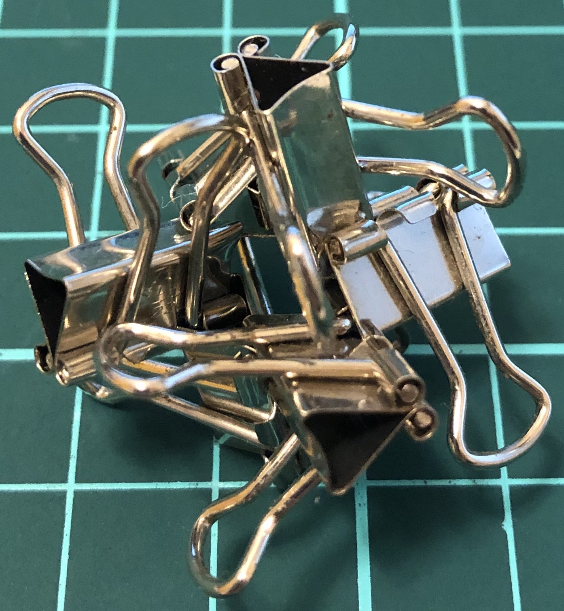
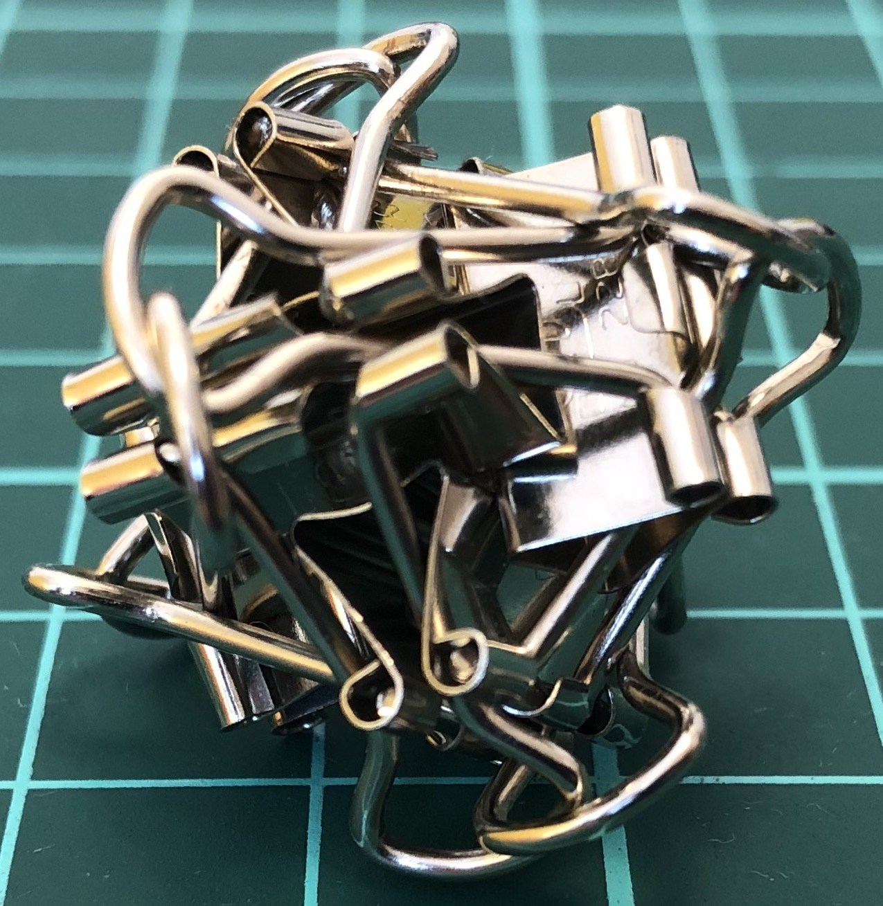

# Oriclip

One of my interests involves building binder clips sculptures.
The name *oriclip* is inspired by *origami*,
which stands for *ori* “fold” and *kami* “paper”.
Note that binder clips are sometimes called foldover clip or foldback clip.

(The page is under construction; check back later.)

## 6-clip constructions

  
Symmetry group: triangular prism's rotations, $D_6$ of order 6.

  
Symmetry group: tetrahedron's rotations, $A_4$ of order 12.

  
Symmetry group: tetrahedron's rotations, $A_4$ of order 12.

  
Symmetry group: tetrahedron's rotations, $A_4$ of order 12.

  
Symmetry group: tetrahedron's rotations, $A_4$ of order 12.

  
Symmetry group: tetrahedron's rotations and reflections, $S_4$ of order 24.
