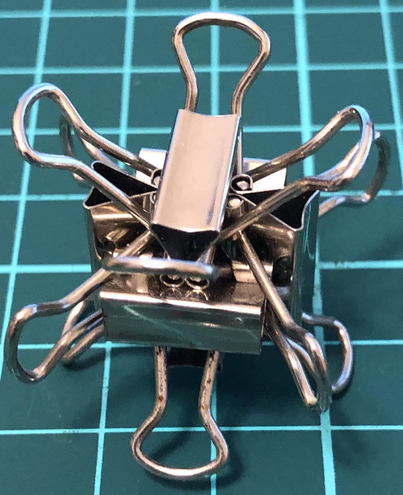

# Oriclip

One of my interests involves building binder clips sculptures.
The name *oriclip* is inspired by *origami*,
which stands for *ori* “fold” and *kami* “paper”.
Note that binder clips are sometimes called foldover clip or foldback clip.

(The page is under construction; check back later.)

## 6-clip constructions

  
Symmetry group: triangle.

  
Symmetry group: tetrahedron.

  
Symmetry group: tetrahedron.

  
Symmetry group: tetrahedron.

  
Symmetry group: tetrahedron.

  
Symmetry group: tetrahedron with reflections.