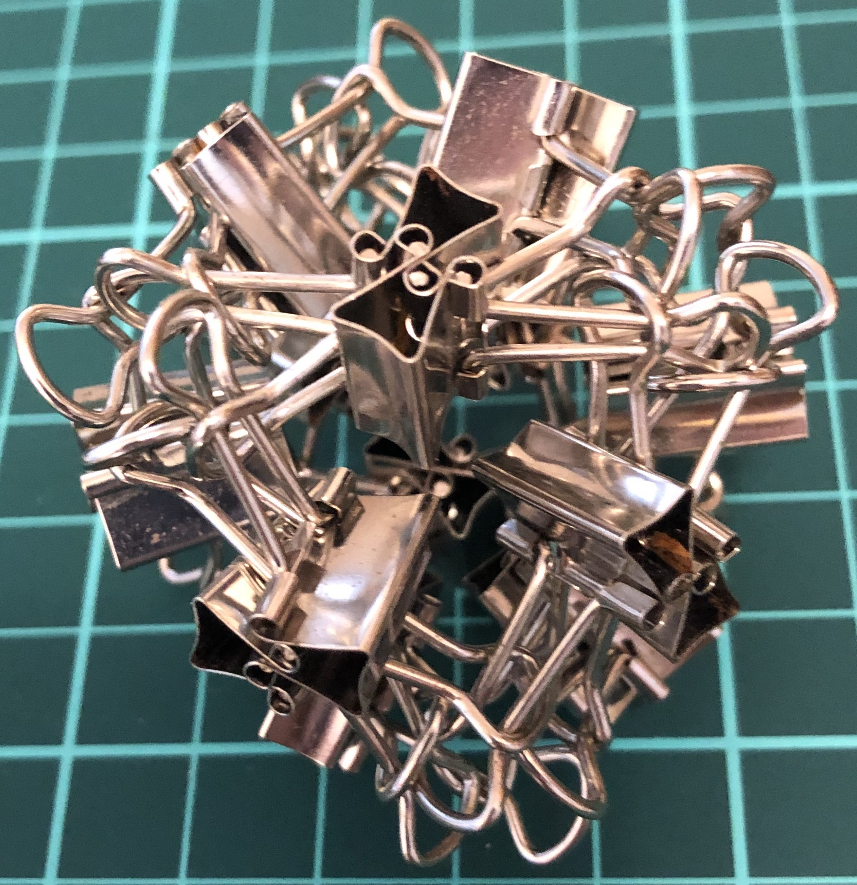
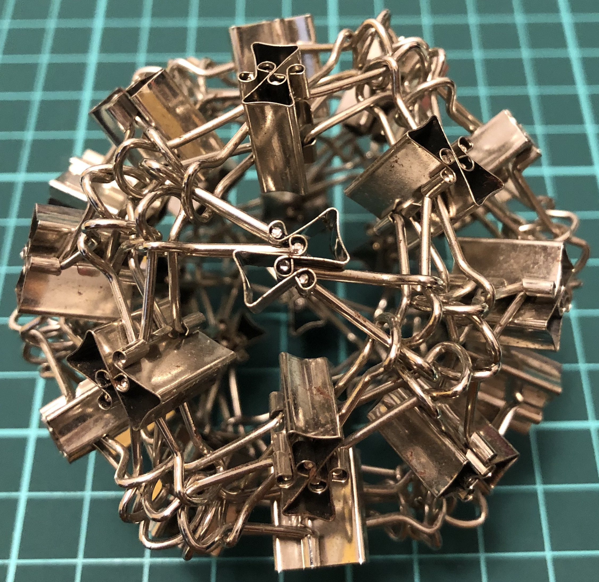

# Oriclip

One of my interests involves building binder clips sculptures.
The name *oriclip* is inspired by *origami*,
which stands for *ori* “fold” and *kami* “paper”.
Note that binder clips are sometimes called foldover clip or foldback clip.

(The page is under construction; check back later.)

## 6-clip constructions

  
Symmetry group: triangular prism's rotations, $D_6$ of order 6.

  
Symmetry group: tetrahedron's rotations, $A_4$ of order 12.

  
Symmetry group: tetrahedron's rotations, $A_4$ of order 12.

  
Symmetry group: tetrahedron's rotations, $A_4$ of order 12.

  
Symmetry group: pyritohedron rotations and reflections, $A_4\times C_2$ of order 24.

  
Symmetry group: pyritohedron rotations and reflections, $A_4\times C_2$ of order 24.

## I-series

  
Symmetry group: tetrahedron's rotations, $A_4$ of order 12.

  
Symmetry group: cube's rotations, $S_4$ of order 24.

  
Symmetry group: cube's rotations, $S_4$ of order 24.

  
Symmetry group: dodecahedron's rotations, $A_5$ of order 60.

  
Symmetry group: dodecahedron's rotations, $A_5$ of order 60.

For more on symmetry group, see
[wiki/Polyhedral group](https://en.wikipedia.org/wiki/Polyhedral_group)
and the references therein.
