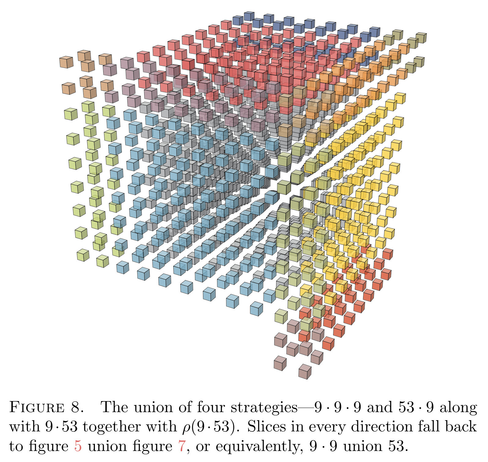

# Distributed Computation Paper

I have once worked on distributed computation of matrix-matrix multiplication.

* [[PlutoCharon20]]
  H.-P. Wang, I. Duursma.
  *Parity-Checked Strassen Algorithm*.
  arXiv.

[[PlutoCharon20]] deals distributed matrix multiplication (DMM), where the workers might straggle or
crash, by combining ideas from fast matrix multiplication (FMM).  By MM we mean the computation of
$C = A \times B$, where $A, B$ are huge matrices with compatible dimensions.  (Do not confuse MM
with matrix-vector multiplication, as the latter does not have a *fast* version.) By distributed we
mean that there will be several workers, each computes a single entry multiplication $A_{ij} \times
B_{jk}$.  By straggling and crashing we mean that some workers might not respond timely, or they
might just hang there indefinitely.

Straggling and crashing is a real issue in real world because, spontaneously, the network may be
busy, the CPU may be overheat, or the circuit board may be hit by cosmic radiation and cannot
recover from it.  This makes the overall computation slow because we have to wait for the last
worker to tell us the product $A_{ij}B_{jk}$ it is responsible for.

To compensate, we can hire more workers and ask them to carry out redundant computations.  A
possible way to create redundancy is to draw random row vector $g$ and random column vector $h$ and
then ask extra workers to compute $(gA) \times (Bh)$ on top of the usual routine that computes $A
\times B$.  Once this is done, the associativity equation $(gA)(Bh) = gCh$ will give us some parity
checks that help recover the missing entries of $C$.  The overhead of using parity checks to recover
missing entries of $C$ is usually faster than waiting for the straggling workers to recover.  So we
can actually save time by paying for more CPU times.

The contribution of [[PlutoCharon20]] is three-fold.

* One: We obverse that the routine computation of $A\times B$ can be carried-out by fast matrix
  multiplication (FMM).  This construction is named **Pluto codes** because the smallest working
  example uses nine workers and can afford breaking one, which reminds us that Pluto used to be the
  ninth planet.

* Two: Applying Pluto codes recursively, we obtain codes that behave like tensor product codes.
  Tensor produce codes have fast iterative decoders that is parallelism-friendly.  This fits the
  current context of distributed computation.

* Three: We observe that the computation of $(gA) \times (Bh)$, when $g$ and $h$ are matrices, can
  be carried-out by FMM as well.  This is named **Charon construction** after the moon of Pluto.
  (Fun fact: Charon is the largest moon when it comes to relative size.)
  
The smallest working example of the Charon construction is when $g$, $A$, $B$, and $h$ are $2 \times
4$, $4 \times 4$, $4 \times 4$, and $4 \times 2$, respectively.  The computation of $A \times B$
costs 49 workers, the computation of $(gA) \times (Bh)$ costs 14 workers.  Together we need 63
workers, one fewer than the naive algorithm uses (64 workers).  So we are using less workers, yet we
can recover from four erasures with high probability.

Here is a figure I made to explain the tensor structure of Pluto.

[PlutoCharon20]: https://arxiv.org/abs/2011.15082
