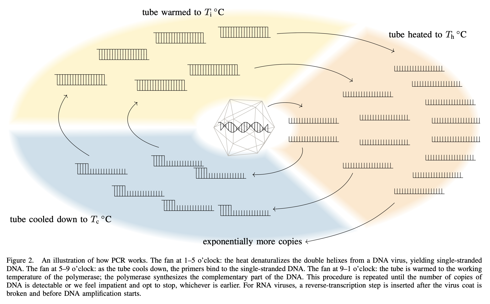
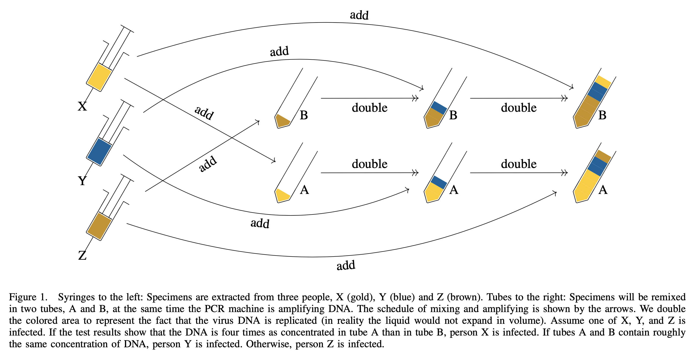
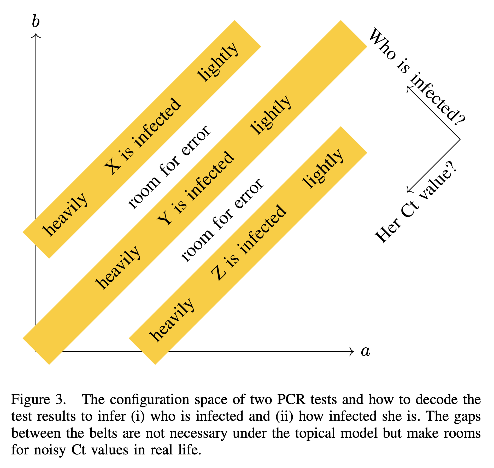
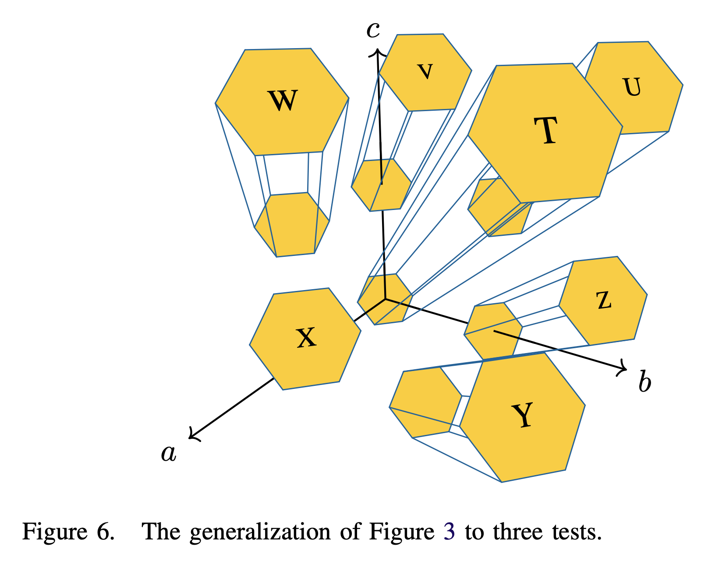
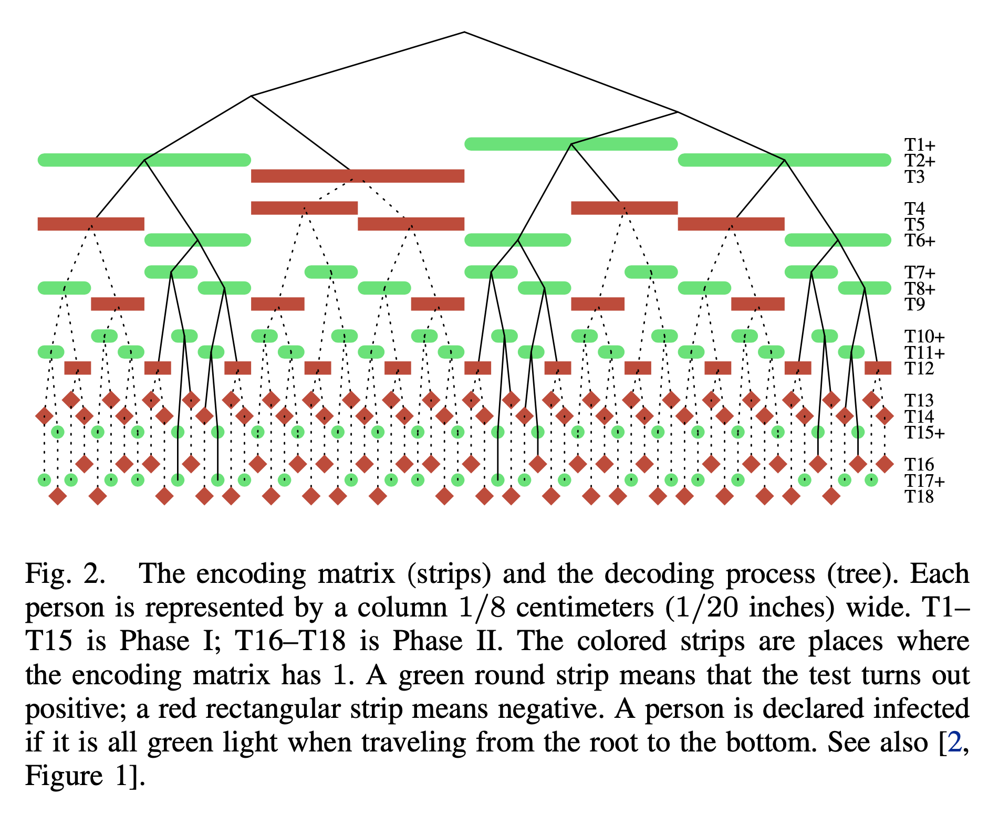
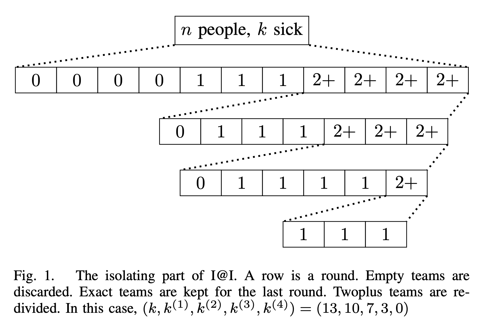

# Group Testing Papers

* [[PCR-TGT-22]]
  H.-P. Wang, R. Gabrys, A. Vardy.
  *PCR, Tropical Arithmetic, and Group Testing*.
  ISIT.
* [[BonsaiGT23]]
  H.-P. Wang, R. Gabrys, V. Guruswami.
  *Quickly-Decodable Group Testing with Fewer Tests: Price--Scarlett's Nonadaptive Splitting with Explicit Scalars.*
  ISIT.
* [[TropicalGT23]]
  H.-P. Wang, R. Gabrys, A. Vardy.
  *Tropical Group Testing*.
  IEEE TIT.
  (journal version of [[PCR-TGT-22]].)
* [[Measure1Cut1-24]] H.-P. Wang, V. Guruswami.
  *Isolate and then Identify: Rethinking Adaptive Group Testing*.
  ISIT.

Overwhelmed by the Covid-19 pandemic, we study the possibility of using group testing to help
finding the carrier of SARS-CoV-2.  (Fun fact: Covid-19 is the name of the disease; SARS-CoV-2 is
the name of the virus.)  The idea of group testing is simple: Suppose that there are 5 students that
we want to test.  We can test if each of their saliva specimens contains the virus, which will costs
us 5 testing kits.  We can also combine the 5 saliva specimens and test once, which will cost us 1
testing kit.  If the test result is negative, then we know none of the 5 students have the virus.
However, if the test result is positive, then at least one student has the virus.  We then 5 more
testing kits to find which of these 5 students have virus.  Over all, the average cost is $1/5 + p$
testing kits per student we want to test, where $p$ is the probability that the mixture of 5 saliva
specimens is positive.

Now, one interesting aspect about testing for SARS-CoV-2 is that, in the beginning of the pandemic,
this virus is so new and the whole situation is so emergency that the only reliable way is to test
if a specimen contains the DNA fragments that belong to SARS-CoV-2.  And the only reliable way to do
so is to tell the polymerase to **amplify** (which is a fancy way to say duplication) the targeted
fragments until the specimen contains nothing but the targeted fragments.  For instance, suppose
there are three types of DNA fragments, and denote the numbers of copies by $x$, $y$, and $z$,
respectively.  Suppose that the second type is what we are looking for; we then tell the polymerase
to amplify that so the numbers of copies becomes $(x, 2y, z)$ after one cycle, $(x, 4y, z)$ after
two cycles, and so on, until $2^c y$ is too large compared to $x$ and $z$ and it becomes very easy
to detect.  This is how **PCR testing** works.

A byproduct of the PCR testing is that, if a specimen contains a lot of virus particles, it would
naturally contains a lot of DNA fragments and so the polymerase will need very few cycles to amplify
that to a detectable degree.  On the other hand, if we begin with very few DNA fragments, it would
take the polymerase a lot of cycles.  So by monitoring the amount of DNA fragments during
amplification, we get a rough idea of the number of virus particles in a specimen.  The term **Ct
value** (which stands for cycle threshold value) is used to denote the number of cycles the
polymerase needs.  Let $c$ denote the Ct value and $v$ denote the number of virus particles, then  $
c \approx 40 - \lfloor\log_2(v)\rfloor $ is a relation between $c$ and $v$ subject to errors.

So we want to combine group testing and Ct value.  But Ct value is very nasty to work with.
Naturally, if we combine a specimen with $1$ virus particle and another specimen with $1000$ virus
particles, we get a mixture with $1001$ virus particles.  But that's not how Ct value works, as $1$,
$1000$, and $1001$ virus particles correspond to Ct values $40$, $30$, and $30$.  That is to say, a
smaller Ct value tend to **mask** a larger Ct value to the point that it completely erases the
information.  Therefore, we proposed Tropical Group Testing [[TropicalGT23]], which is a framework
to study the how group testing and Ct values should interplay.

The following is a toy example of how tropical GT works, we add specimens at different cycles to
encode information.

And to decode the test results, we compare those with the following figure.

The significance of this plot is its resemblance to UCSD's logo.  I also draw a three-dimensional
version for if there are three tests and seven students to be tested.

Later, when Covid-19 came to an end, we turned to more classical setting of group testing---the one
with binary outputs.  In [[BonsaiGT23]], we found that a construction of Cheraghchi--Nakos and
Price--Scarlett are actually stronger than their analysis indicates.  To be more precise,
the question here is whether low-complexity group testing can perform as well as high-complexity
group testing, and our result shows that the former is indeed almost as good as a well-studied
algorithm called COMP.

The following figure summarizes how Cheraghchi--Nakos and Price--Scarlett's decoding algorithm
works.

Hence the name "bonsai".

In [[Measure1Cut1-24]], we study adaptive group testing.  The original goal was to spend the first
round of test to make some auxiliary measurements to isolate sick students; and then we spend the
second round to identify the sick students.  It turns out that one round for isolation is not
enough unless we increase the number of tests by a huge amount.  But minimizing the number of tests
has a higher hierarchy than minimizing number of rounds.  So we end up taking our time
and cut the students in multiple rounds.  That said, the identification part requires only one round
and is capacity-achieving.  That is, the number of tests spent here matches the predication made by
measuring the entropy each test gives us.

So the name "measure once, cut once" didn't come true.  That said, we are very close to the goal.
The work stated that $\log k$ rounds are enough.  But we conjecture that $\log(\log k)$ rounds might
be enough without changing the other parameters in the existing result.

[TropicalGT22]: https://arxiv.org/abs/2201.05440
[PCR-TGT-22]: https://doi.org/10.1109/ISIT50566.2022.9834718
[BonsaiGT23]: https://doi.org/10.1109/ISIT54713.2023.10206843
[TropicalGT23]: https://doi.org/10.1109/TIT.2023.3282847
[Measure1Cut1-24]: https://doi.org/10.1109/ISIT57864.2024.10619098