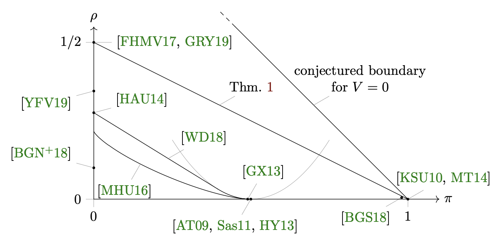
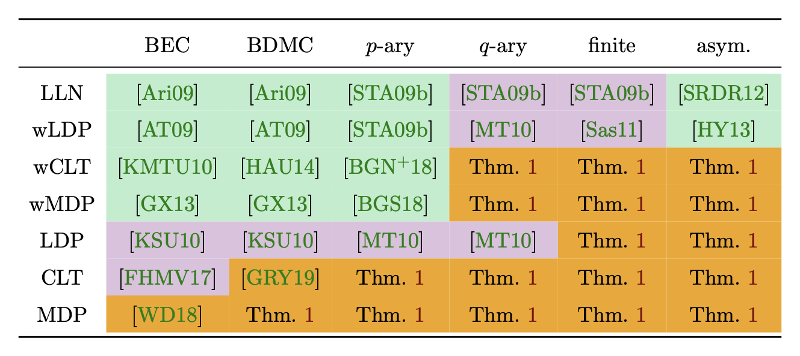
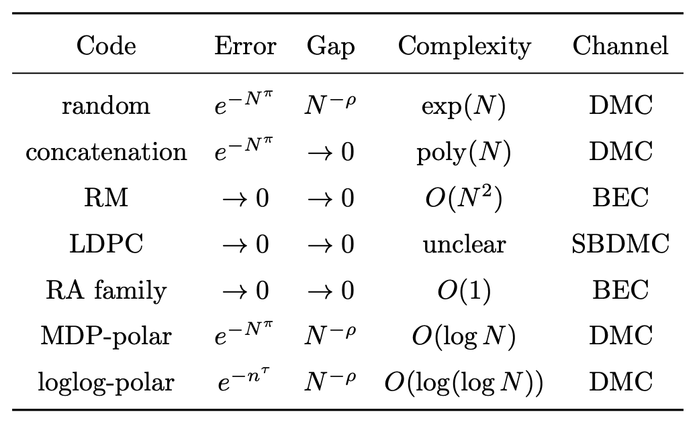
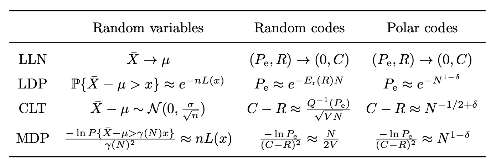

# Polar Comments

The following are my works on polar coding, from the oldest to the newest.

|  Abbreviation  |  Title                                                              |
| :------------: | :-----------------------------------------------------------------: |
| [ModerDevia18] | Polar Code Moderate Deviation: Recovering the Scaling Exponent      |
| [LargeDevia18] | Polar-like Codes and Asymptotic Tradeoff among Block Length, Code Rate, and Error Probability |
| [LoglogTime18] | Log-logarithmic Time Pruned Polar Coding on Binary Erasure Channels |
| [LoglogTime19] | Log-logarithmic Time Pruned Polar Coding                            |
| [Hypotenuse19] | Polar Codes' Simplicity, Random Codes' Durability                   |
| [LoglogTime21] | Log-logarithmic Time Pruned Polar Coding (IEEE.TIT version of [LoglogTime19]) |
| [Hypotenuse21] | Polar Codes' Simplicity, Random Codes' Durability (IEEE.TIT version of [Hypotenuse19]) |
| [PhDThesis21]  | Complexity and Second Moment of the Mathematical Theory of Communication|

[ModerDevia18] focuses on the moderate deviations regime (MDR) of polar coding.
MDR is also called the **moderate deviations principle** (MDP)
paradigm in some references.
It addresses the relation among block length ($N$),
error probability ($P_e$), and code rate ($R$) in the region
where $P_e$ is about $\exp( -N^\pi )$ and $R$ is about
$\text{Capacity} - N^{-\rho}$ for some positive numbers $\pi, \rho$.
The precise goal is to characterize the region of $(\pi, \rho)$ pairs
that are achievable for $N \to \infty$.

While [ModerDevia18] deals with classical polar codes
as constructed in Arıkan's original paper,
[LargeDevia18] extends the theory to a wide class of polar codes.
Given a kernel $G$, its scaling exponent $\mu$
(or its inverse $\rho = 1/\mu$), and its partial distances,
we are able to predict how codes constructed with $G$ will behave,
up to some big-$O$ notations.
Remark:
The result says it is easy to go from $\rho$ (or $\mu$) to MDP.
But $\rho$ is usually difficult to estimate.
Alternatively, there are easy ways to bound $\rho$.
In that case, our MDP prediction becomes a one-way bound.

[LoglogTime18] stands on the result of [ModerDevia18] and shows that,
if we would like to tolerate higher $P_e$ and lower $R$,
we can reduce the encoding and decoding complexities
from $\log N$ per information bit to $\log(\log N)$ per information bit.
By *higher $P_e$* we mean that $P_e$ scales as $N^{-1/5}$;
By *lower $R$* we that mean that $R$ scales as $\text{Capacity}-N^{-1/5}$.
Thus the constructed codes barely, but still, achieve capacity.

While [LoglogTime18] deals with the binary erasure channels,
[LoglogTime19] handles arbitrary symmetric $p$-ary channels,
where $p$ is any prime.
The latter result is similar---by tolerating that $P_e$ converges to $0$ slower
and that $R$ converges to the capacity slower,
we can reduce the complexity to $\log(\log N)$ per information bit.
In both [LoglogTime18] and [LoglogTime19],
codes are construct with the standard kernel $[^1_1{}^0_1]$.

We later found (not included in any paper) that the log-log behavior
generalizes to arbitrary discrete memoryless channels.
For general channels, however,
the standard kernel $[^1_1{}^0_1]$ does not polarize anymore.
One must switch to other kernels, sometimes nonlinear.

[Hypotenuse19] shows that it is possible to construct codes
whose error probabilities and code rates scale like random codes'
and encoding and decoding complexities scale like polar codes'.
On one hand, random codes' error and rate are considered the optimal.
On the other, polar codes' complexity ($\log N$) is considered low.
(Not the lowest possible complexity, as there exist $\log(\log N)$
constructions for general channels and $O(1)$ constructions for BEC.)
This result holds for all discrete memoryless channels,
the family of channels Shannon considered in 1948.

[PhDThesis21] is my PhD dissertation.
It will be released on arXiv soon.

For a figurative comparison, see
[Figure 1 on page 3](https://arxiv.org/pdf/1912.08995v1.pdf#page=3)
in Hypotenuse19.

See also the following table for channels, goals, and references.
(Will be in [PhDThesis21].)

Here is a table for the error--gap--complexity trade-offs of
some well-known capacity-achieving codes and the corresponding channels.

The following table is an analog among
probability theory, random coding theory, and polar coding theory.

[ModerDevia18]: https://arxiv.org/abs/1806.02405
[LoglogTime18]: https://arxiv.org/abs/1812.08106
[LargeDevia18]: https://arxiv.org/abs/1812.08112
[LoglogTime19]: https://arxiv.org/abs/1905.13340
[Hypotenuse19]: https://arxiv.org/abs/1912.08995
[LoglogTime21]: https://doi.org/10.1109/TIT.2020.3041523
[Hypotenuse21]: https://doi.org/10.1109/TIT.2020.3041570
