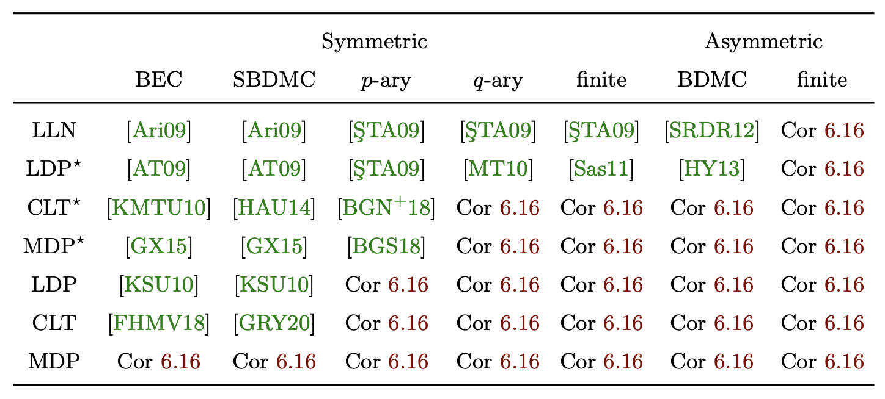
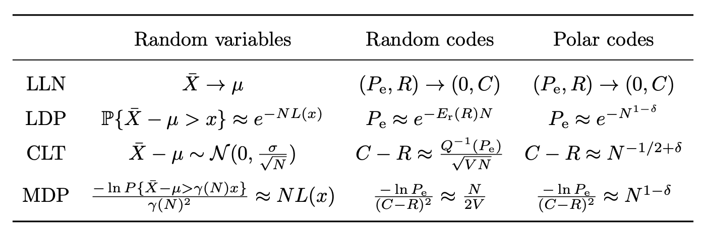

# Polar Code Papers

The following are my works on polar coding, from the oldest to the newest.

* [[ModerDevia18]]
  H.-P. Wang, I. Duursma.
  *Polar Code Moderate Deviation: Recovering the Scaling Exponent*.
  arXiv.
* [[LargeDevia18]]
  H.-P. Wang, I. Duursma.
  *Polar-like Codes and Asymptotic Tradeoff among Block Length, Code Rate, and Error Probability*.
  arXiv.
* [[LoglogTime18]]
  H.-P. Wang, I. Duursma.
  *Log-logarithmic Time Pruned Polar Coding on Binary Erasure Channels*.
  arXiv.
* [[LoglogTime19]]
 H.-P. Wang, I. Duursma.
  *Log-logarithmic Time Pruned Polar Coding*.
  arXiv.
* [[Hypotenuse19]]
  H.-P. Wang, I. Duursma.
  *Polar Codes' Simplicity, Random Codes' Durability*.
  arXiv.
* [[LoglogTime21]]
  H.-P. Wang, I. Duursma.
  *Log-logarithmic Time Pruned Polar Coding*.
  IEEE Transactions on Information Theory.
  (Journal version of [[LoglogTime19]].)
* [[Hypotenuse21]]
  H.-P. Wang, I. Duursma.
  *Polar Codes' Simplicity, Random Codes' Durability*.
  IEEE Transactions on Information Theory.
  (Journal version of [[Hypotenuse19]].)
* [[PhDThesis21]]
  H.-P. Wang.
  *Complexity and Second Moment of the Mathematical Theory of Communication*.
* [[Sub-4.7-mu22]]
  H.-P. Wang, T.-C. Lin, A. Vardy, R.Gabrys.
  *Sub-4.7 Scaling Exponent of Polar Codes*.
  arXiv.
* [[TetraErase22x]]
  I. Duursma, R. Gabrys, V. Guruswami, T.-C. Lin, H.-P. Wang.
  *Accelerating Polarization via Alphabet Extension*.
  arXiv.
* [[TetraErase22]]
  I. Duursma, R. Gabrys, V. Guruswami, T.-C. Lin, H.-P. Wang.
  *Accelerating Polarization via Alphabet Extension*.
  International Conference on Randomization and Computation (RANDOM).
  (Conference version of [[TetraErase22x]].)
* [[Sub-4.7-mu23]]
  H.-P. Wang, T.-C. Lin, A. Vardy, R. Gabrys.
  *Sub-4.7 Scaling Exponent of Polar Codes*.
  IEEE Transactions on Information Theory.

In the early days, my research focuses on the **moderate deviations principle (MDP) paradigm** of
noisy-channel coding.  MDP addresses the joint relation among block length ($N$), error probability
($P_e$), and code rate ($R$) in a parameter region  

* $P_e \approx \exp(-N^\pi)$,  
* $\text{Capacity} - R \approx N^{-\rho}$,

for some positive numbers $\pi$ and $\rho$.  The precise goal is to characterize the region of
$(\pi, \rho)$-pairs that are achievable for $N \to \infty$.

The MDP paradigm is a combination of the large deviations principle (LDP) paradigm and the central
limit theorem (CLT) paradigm.  In LDP, one cares about the asymptotic behavior of $P_e$ but not so
much about $R$.  In the CLT paradigm, it is the opposite, that the asymptotic behavior of $R$ is
studied and $P_e$ more or less stays constant.

It all begin with Mondelli, Hassani, and Urbanke's work *Unified Scaling of Polar Codes: Error
Exponent, Scaling Exponent, Moderate Deviations, and Error Floors* [[MHU16]].  This work shows that
the scaling exponent of polar coding is $\mu \approx 3.627$ over binary erasure channels (BECs) and
$\mu < 4.714$ over binary memoryless symmetric (BMS) channels.  Here, the scaling exponent $\mu$ is
the lowest value $1/\rho$ can take if $P_e$ is a constant.  On top of that, this works gives a
characterization of the region of $(\pi, \rho)$-pairs.  However, this region does not touch the
point $(0, 1/3.627)$ for the BEC case or $(0, 1/4.714)$ for the BMS case, which suggests that
something nontrivial happens when we make constant $P_e$ exponential decay.

My work [[ModerDevia18]] addresses the mismatch and shows that, using a complicated combinatorial
counting method, the region of $(\pi, \rho)$-pairs will touch $(0, 1/3.627)$.  Hence the slogan
*moderate deviations recovers the scaling exponent*.

While [[ModerDevia18]] deals with classical polar codes as constructed in Arıkan's original paper,
[[LargeDevia18]] extends this theory to a wide class of polar codes.  Given a kernel $K$, its
scaling exponent $\mu$, and its partial distances, we are able to predict how polar codes
constructed using $K$ will behave in terms of the region of $(\pi, \rho)$-pairs.  Remark: This
result says that it is easy to prove MDP given an estimate of $\mu$.  But $\mu$ is usually difficult
to estimate.

[[LoglogTime18]] stands on the result of [[ModerDevia18]] and shows that, if we would like to
tolerate slightly worse $P_e$ and $R$, we can reduce the encoding and decoding complexities from
$O(\log N)$ per information bit to $O(\log(\log N))$ per information bit.  By *worse $P_e$* we mean
that $P_e$ scales as $N^{-1/5}$.  By *worse $R$* we that mean that $\text{Capacity} - R$ scales as
$N^{-1/5}$.  Note that the constructed code still achieves capacity, just not as fast as before.

While [[LoglogTime18]] deals with BECs, [[LoglogTime19]] handles arbitrary symmetric $p$-ary
channels, where $p$ is any prime.  The main theorem in the new paper follows the recipe of the old
paper---by tolerating that $P_e$ converges to $0$ slower and that $R$ converges to the capacity
slower, we can reduce the complexity to $\log(\log N)$ per information bit.

Note that, in both [[LoglogTime18]] and [[LoglogTime19]], codes are constructed with the standard
kernel $[^1_1{}^0_1]$; yet the same idea applies if a general kernel $K$ is used.  What's more,
the log-log behavior generalizes to arbitrary discrete memoryless channels (DMCs).  For general
channels, however, the standard kernel $[^1_1{}^0_1]$ does not polarize anymore.  So the observation
that a general kernel $K$ is compatible with the log-log trick is crucial here.

Now comes my favorite work.

[[Hypotenuse19]] shows that it is possible to construct codes whose error probabilities and code
rates scale like random codes' and encoding and decoding complexities scale like polar codes'.  On
one hand, random codes' error and rate are considered the optimal.  On the other, polar codes'
complexity ($\log N$) is considered low.  (Not the lowest possible complexity, as $\log(\log N)$
complexity is possible for general channels and $O(1)$ is possible for BECs.) This result holds for
all DMCs, the family of channels Shannon considered in 1948.

[[PhDThesis21]] is my PhD dissertation.  I summarize my earlier works and extend them a little bit.

* I show that any ergodic matrix has a positive $\rho$.
* I show that you can combine [[LoglogTime21]] with [[Hypotenuse21]] to obtain a code with $\rho
  \approx 1/2$ and log-log complexity
* I claim, and show with examples, that the same scaling behavior applies to distributed lossless
  compression and multiple access channels.

For a figurative comparison of the region of $(\pi, \rho)$, see
[Figure 1 on page 3](https://arxiv.org/pdf/1912.08995v1.pdf#page=3)
of \[Hypotenuse19\] or
[Figure 5.4 on page 57](https://arxiv.org/pdf/2107.06420.pdf#page=63)
of \[PhDThesis21\].

See also the following table for channels versus goals and references.  It is
[Table 6.1 on page 98](https://arxiv.org/pdf/2107.06420.pdf#page=104)
of \[PhDThesis21\].

Here is a table for the error--gap--complexity trade-offs of some well-known capacity-achieving
codes and the corresponding channels, obtained from
[Table 7.1 on page 103](https://arxiv.org/pdf/2107.06420.pdf#page=109)
of \[PhDThesis21\].

The following table, taken from
[Table 5.1 on page 55](https://arxiv.org/pdf/2107.06420.pdf#page=61)
of \[PhDThesis21\], describes an analog among probability theory, random coding theory, and polar
coding theory.

In the next two works, [[Sub-4.7-mu22]] and [[TetraErase22]], I pivot from MDP to CLT.  To be more
precise, since any further improvement of MDP will probably come from improvement of the scaling
exponent, I try to attack the latter.

[[Sub-4.7-mu22]] considers the standard setting of polar code: the standard kernel $[^1_1{}^0_1]$
over BMS channels.  Before it was proved in [[MHU16]] that $\mu < 4.71$.  We show that $\mu < 4.63$.
This improvement is small, but it carries a strong message that considering the iteration one at a
time is not enough.  In this work, we consider two iterations.  We are able to show that, the first
iteration will make BMS channel *less BSC*, and the second iteration will make use of the fact that
the non-BSC channels polarize faster.

[[TetraErase22]] is another attempt to improve scaling exponent.  But this time the target is BECs.
For BECs, it is known for a long time that $\mu \approx 3.627$ [[MHU16]].  It is also known for a
long time that to improve $\mu$, one can use a larger kernel matrix $K$ [[FVY19]].  We go for
another direction: enlarging the alphabet size.  We show that, by enlarging the alphabet size from
$2$ to $4$, the scaling exponent improves from $3.627$ to $3.3$.  It would have take a $20 \times
20$ (linearly interpolated) matrix to achieve the same improvement.

[MHU16]: https://doi.org/10.1109/TIT.2016.2616117
[FVY19]: https://doi.org/10.1109/ISIT.2019.8849741
[ModerDevia18]: https://arxiv.org/abs/1806.02405
[LoglogTime18]: https://arxiv.org/abs/1812.08106
[LargeDevia18]: https://arxiv.org/abs/1812.08112
[LoglogTime19]: https://arxiv.org/abs/1905.13340
[Hypotenuse19]: https://arxiv.org/abs/1912.08995
[LoglogTime21]: https://doi.org/10.1109/TIT.2020.3041523
[Hypotenuse21]: https://doi.org/10.1109/TIT.2020.3041570
[PhDthesis21]: https://arxiv.org/abs/2107.06420
[Sub-4.7-mu22]: https://arxiv.org/abs/2204.11683
[TetraErase22x]: https://arxiv.org/abs/2207.04522
[TetraErase22]: https://doi.org/10.4230/LIPIcs.APPROX/RANDOM.2022.17
[Sub-4.7-mu23]: https://doi.org/10.1109/TIT.2023.3253074