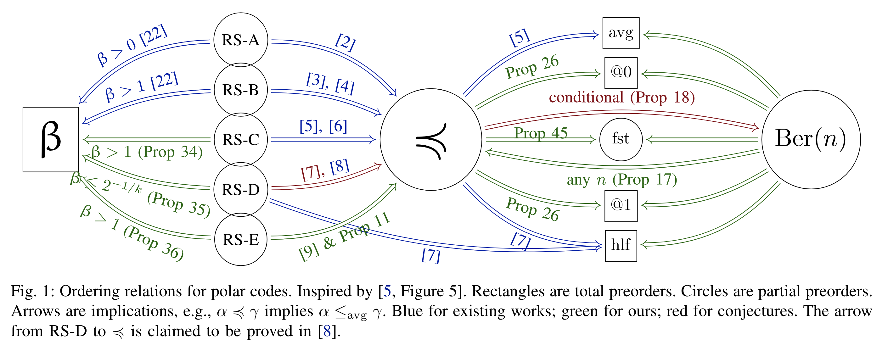
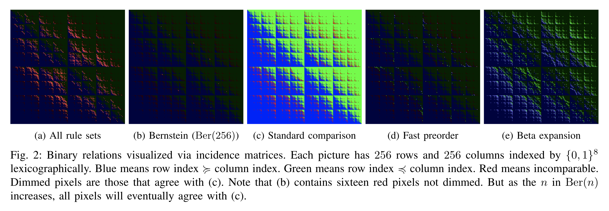
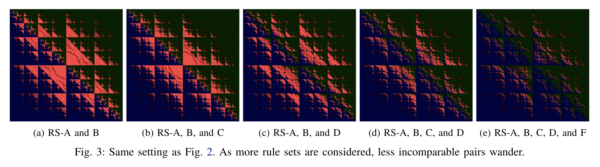
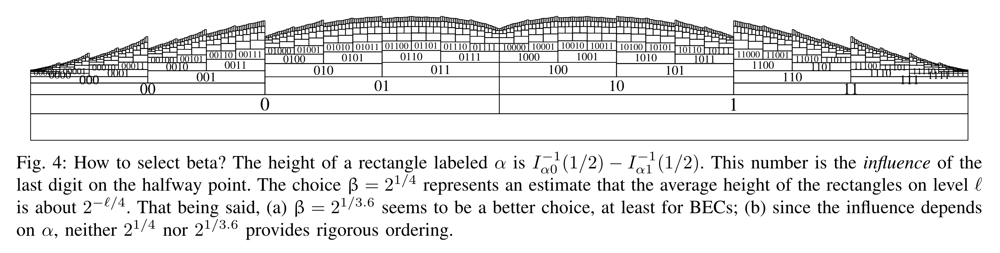
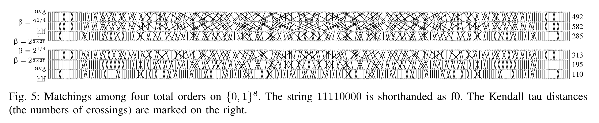
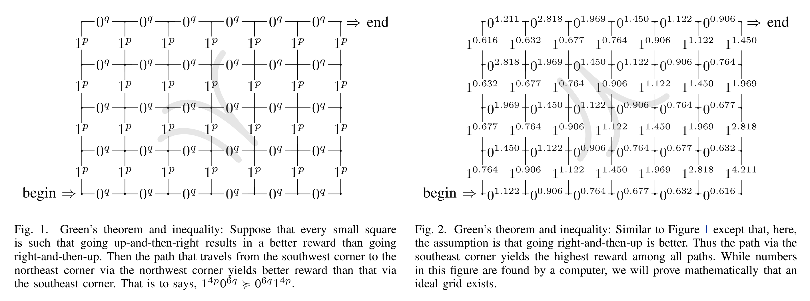
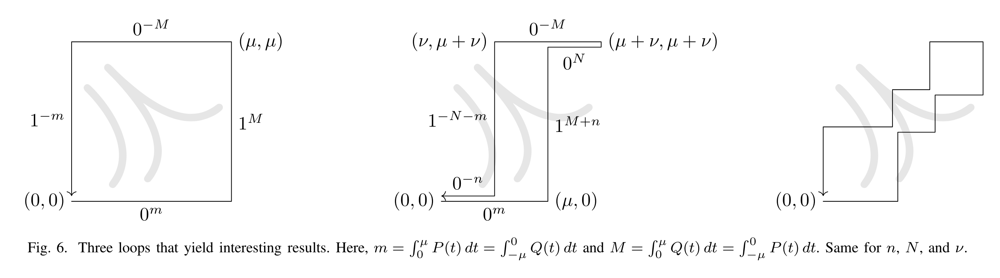

# Polar Order Papers

One of the very first questions my PhD advisor gave me is how to order the synthetic channels that
are generated during polar coding.  These papers address that.

* [[Polder-ODE23]]
  T.-C. Lin, H.-P. Wang.
  *Optimal Self-Dual Inequalities to Order Polarized BECs*.
  ISIT.
* [[Polder-Conjugate23]]
  H.-P. Wang, C.-W. Chin.
  *Density Devolution for Ordering Synthetic Channels.
  ISIT.
* [[Polder-Finer23]]
  H.-P. Wang, V.-F. Dragoi.
  *Fast Methods for Ranking Synthetic BECs*.
  ISIT.

Here is a collection of figures I am proud of.  More in the papers.

[Polder-Finer23]: https://doi.org/10.1109/ISIT54713.2023.10206704
[Polder-ODE23]: https://doi.org/10.1109/ISIT54713.2023.10206451
[Polder-Conjugate23]: https://doi.org/10.1109/ISIT54713.2023.10206540
