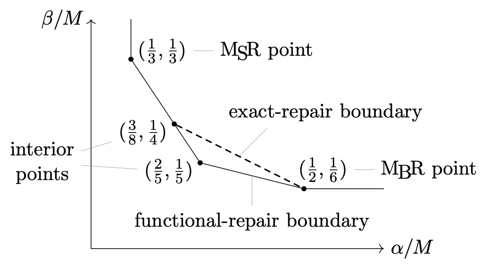
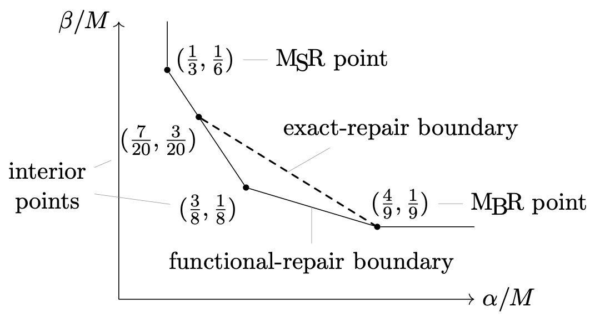

# Distributed Storage Papers

The following are my works on distributed storage systems.  They concern
regenerating codes.

* [[MoulinAlg20]]
  I. Duursma, H.-P. Wang.
  *Multilinear Algebra for Distributed Storage*.
  arXiv.
* [[Atrahasis20]]
  I. Duursma, X. Li, H.-P. Wang.
  *Multilinear Algebra for Minimum Storage Regenerating Codes*.
  arXiv.
* [[MoulinAlg21]]
  I. Duursma, H.-P. Wang.
  *Multilinear Algebra for Distributed Storage*.
  SIAM Journal on Applied Algebra and Geometry (SIAGA).
  (Journal version of [[MoulinAlg20]])
* [[Atrahasis21]]
  I. Duursma, X. Li, H.-P. Wang.
  *Multilinear Algebra for Minimum Storage Regenerating Codes:
   A Generalization of Product-Matrix Construction*.
  Applicable Algebra in Engineering, Communication and Computing.
  (Journal version of [[Atrahasis20]])

A **regenerating code** consists of

* a file of size $M$ symbols and
* a system of $n$ storage devices, called **nodes**.

The configuration of the nodes satisfies the following conditions:

* Each node stores $\alpha$ symbols of the file.
* Any $k$ nodes contains sufficient information to recover the file.
* When a node fails, some $d$ other nodes will each
  send it $\beta$ symbols to repair the failing node.

The code is named regenerating mainly due to the last bullet point---the
nodes regenerate themselves.

The theory of regenerating codes concerns the relation among $n, k, d,
\alpha, \beta, M$.  For example, since any $k$ nodes contain $k\alpha$
symbols and can recover the file, the file size $M$ is at most
$k\alpha$.  Similarly, since $d\beta$ symbols repair a failing node, the
node size $\alpha$ is at most $d\beta$.  (Exercise) One can also show
that $k - 1$ nodes ($\alpha$) plus $d - k + 1$ help messages ($\beta$)
is at least $M$.  There is a family of bounds of this type.  They are
called *cut-set bounds* and restrict where those parameters can live.

The opposite approach is to construct regenerating codes that aim to
achieve low $\alpha$, low $\beta$, and high $M$.  [[MoulinAlg20]]
utilizes multilinear algebra to do this.  We construct a series of
regenerating codes which we call **Moulin codes**.  They achieve the
best known $\alpha/M$-versus-$\beta/M$ trade-off to date.  And it is
conjectured that this trade-off is optimal.

See
[Figure 1 on page 3](https://arxiv.org/pdf/2006.08911v1.pdf#page=3)
in [MoulinAlg20] for the $\alpha/M$-versus-$\beta/M$ trade-off for the
$(n, 3, 3)$ case.

Here is another $\alpha/M$-versus-$\beta/M$ trade-off for the $(n, 3,
4)$ case.  (In a newer version of [MoulinAlg20] that I am still working
on.)

For more general parameters, check out
[this D3.js plot](homogeneous.html).

See also
[Table 2 on page 29](https://arxiv.org/pdf/2006.08911v1.pdf#page=29)
for the relations among some competitive constructions.

[[Atrahasis20]] exploits multilinear algebra to construct MSR codes,
which we called **Atrahasis codes**.  Formally, an **MSR code** is a
regenerating code with $M = k\alpha$ and $\beta = \alpha/(d - k + 1)$.
From the constraint on $M$ one sees that there is no wastes of storage
(hence the name **minimum storage regeneration** = MSR).  Some
researchers see MSR codes as the intersection of regenerating codes and
[MDS codes](https://en.wikipedia.org/wiki/Singleton_bound#MDS_codes).

MSR alone attracts significant attentions because people want to minimize
node size ($\alpha \geq M/k$), and only then they minimize help messages
($\beta \geq \alpha/(d - k + 1)$ given that $\alpha \geq M/k$).
See
[Table 1 on page 5](https://arxiv.org/pdf/2006.16998v1.pdf#page=5)
in [Atrahasis20] for a comparison of some existing contraptions.

[MoulinAlg20]: https://arxiv.org/abs/2006.08911
[Atrahasis20]: https://arxiv.org/abs/2006.16998
[MoulinAlg21]: https://doi.org/10.1137/20M1346742
[Atrahasis21]: https://doi.org/10.1007/s00200-021-00526-3
