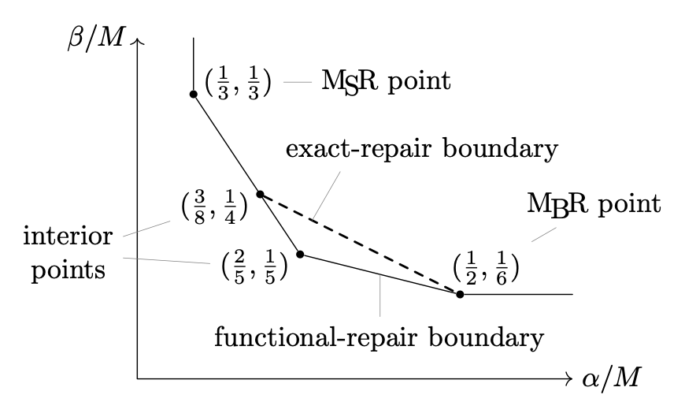
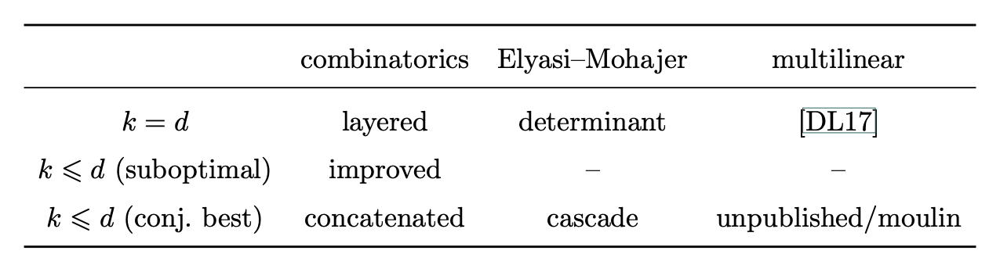
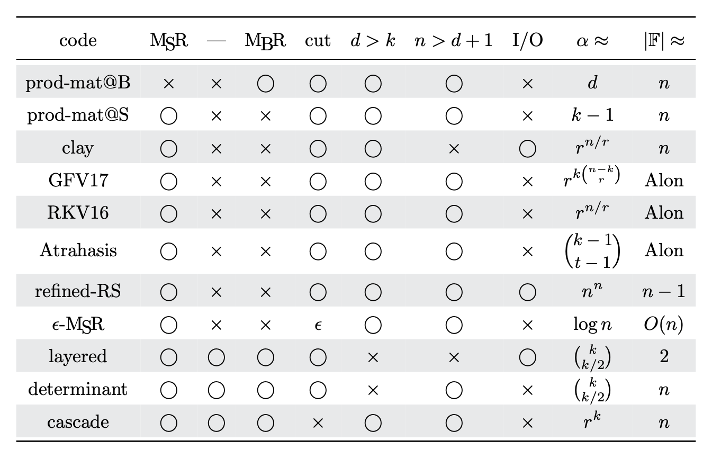

# Distributed Storage Comments

From the oldest to the newest.

|  Abbreviation  |  Title                                                     |
| :------------: | :--------------------------------------------------------: |
| [MoulinAlge20] | Multilinear Algebra for Distributed Storage                |
|  [Atrahasis20] | Multilinear Algebra for Minimum Storage Regenerating Codes |

Both [MoulinAlge20] and [Atrahasis20] concern regenerating codes
that have applications in distributed storage systems.

A **regenerating code** consists of

* a file of size $M$ symbols and
* a system of $n$ storage devices, called **nodes**.

They satisfy the following conditions:

* Each node stores $\alpha$ symbols of the file.
* Any $k$ nodes contains sufficient information to recover the file.
* When a node fails, any $d$ other nodes
    will each sends it $\beta$ symbols to repair.

The code is named regenerating mainly due to
the last bullet point---the nodes regenerate themselves.

The theory of regenerating codes concerns
the relation among $n, k, d, \alpha, \beta, M$.
For example, since any $k$ nodes contain $k\alpha$ symbols
and can recover the file, the file size $M$ is at most $k\alpha$.
Similarly, since $d\beta$ symbols repair a failing node,
the node size $\alpha$ is at most $d\beta$.
(Exercise)
One can also show that $k - 1$ nodes ($\alpha$)
plus $d - k + 1$ help messages ($\beta$) is at least $M$.
There is a family of bounds of this type.
They restrict where those parameters can live.

The opposite approach is to construct regenerating codes
that aim to achieve low $\alpha$ and $\beta$ and high $M$.
[MoulinAlge20] utilizes multilinear algebra to do this.
We construct a series of regenerating codes (which we call **moulin codes**).
They achieve the best known $\alpha/M$-versus-$\beta/M$ trade-off to date.
It is conjectured that this trade-off is optimal.

See
[Figure 1 on page 3](https://arxiv.org/pdf/2006.08911v1.pdf#page=3)
in MoulinAlge20 for an example of $\alpha/M$-versus-$\beta/M$ trade-off.

See also
[Table 2 on page 29](https://arxiv.org/pdf/2006.08911v1.pdf#page=29)
for the relations among some competitive constructions.

[Atrahasis20] exploits multilinear algebra to construct MSR codes
(which we called **Atrahasis codes**).
Formally, an **MSR code** is a regenerating code
with $M = k\alpha$ and $\beta = \alpha/(d - k + 1)$.
From the constraint on $M$ one sees that there is no wastes of storage
(hence the name **minimum storage regeneration** = MSR).
Some researchers see MSR codes as the intersection of regenerating codes
and [MDS codes](https://en.wikipedia.org/wiki/Singleton_bound#MDS_codes).

MSR alone attracts significant attentions because people want to minimize
node size ($\alpha \geq M/k$), and only then they minimize help messages
($\beta \geq \alpha/(d - k + 1)$ given that $\alpha \geq M/k$).
See
[Table 1 on page 5](https://arxiv.org/pdf/2006.16998v1.pdf#page=5)
in Atrahasis20 for a comparison of some existing contraptions.

[PlutoCharon20] concerns distributed computation.
To be precise, it deals with distributed matrix-matrix multiplication (MMM)
where the workers might crash or straggle.
By MMM we mean that we want to compute $C=AB$, where $A, B$ are huge matrices.
By crashing and straggling we mean that an entry multiplication,
for instance $A_{12}\times A_{23}$, might be available very late, if at all.

To compensate, one needs to hire more-than-necessary workers
and asks them to do redundant computations.
A possibility to generate redundancy is to draw random vectors $g, h$
and then ask extra workers to compute $(gA)\times(Bh)$ on top of $A\times B$.

The contribution of [PlutoCharon20] is three-fold.
One: We obverse that the computation of $A\times B$
can be carried-out by fast matrix multiplication (FMM).
This construction is named **Pluto codes**.
Two: Applying Pluto codes recursively,
we obtain a code that behaves like tensor product codes.
Three: The computation of $(gA)\times(Bh)$,
if $g, h$ are matrices, can be carried-out by FMM.
This is named **Charon construction**.

[MoulinAlge20]: https://arxiv.org/abs/2006.08911
[Atrahasis20]: https://arxiv.org/abs/2006.16998
[PlutoCharon20]: https://arxiv.org/abs/2011.15082