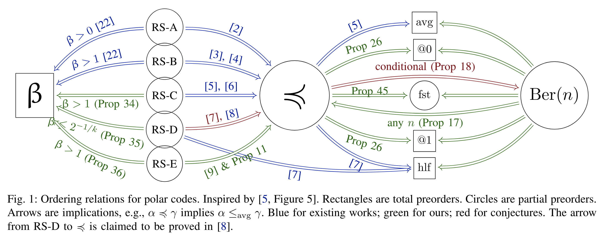
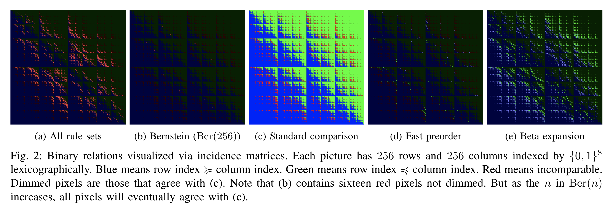
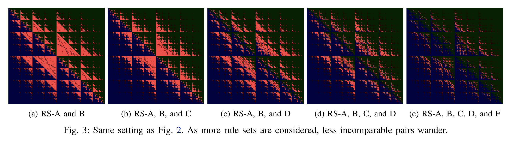
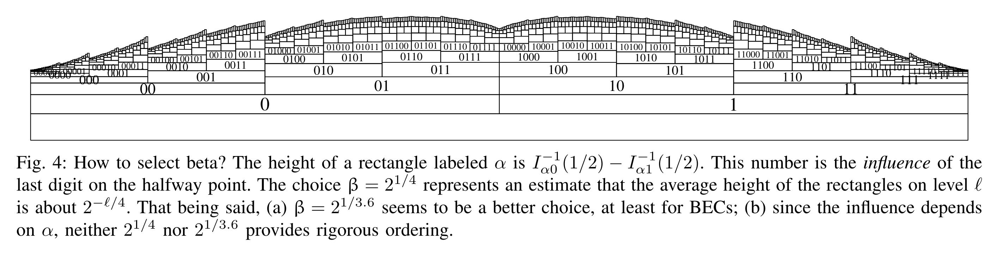
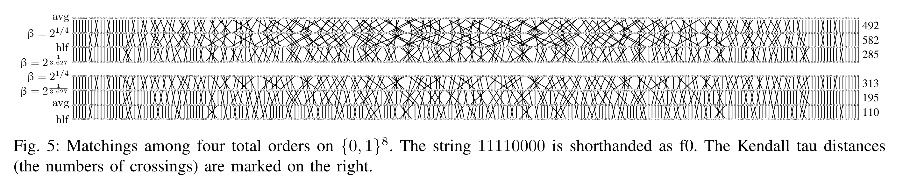
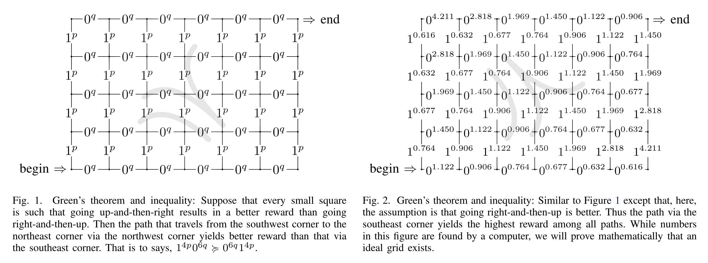
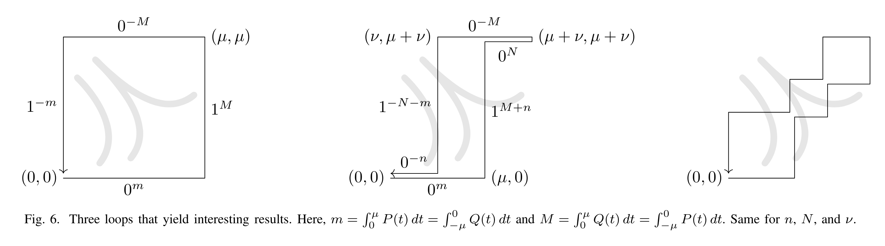

# Polar Order Papers

One of the very first questions my PhD advisor gave me is how to order the synthetic channels that
are generated during polar coding.  These papers address that.

- [[Polder-ODE23]]
  T-C Lin, H-P Wang.
  Optimal Self-Dual Inequalities to Order Polarized BECs.
  *IEEE International Symposium on Information Theory (ISIT)*.
  June 2023, Taipei, Taiwan.
  ([Preprint](https://arxiv.org/abs/2304.07664) and
   4-in-1 [slides](https://drive.google.com/file/d/12sEvE4ErTR7rGy4opnaWTEW0oNqjuVwN/view))

- [[Polder-Conjugate23]]
  H-P Wang, C-W Chin.
  Density Devolution for Ordering Synthetic Channels.
  *IEEE International Symposium on Information Theory (ISIT)*.
  June 2023, Taipei, Taiwan.
  ([Preprint](https://arxiv.org/abs/2304.07667) and
   4-in-1 [slides](https://drive.google.com/file/d/12sEvE4ErTR7rGy4opnaWTEW0oNqjuVwN/view))

- [[Polder-Finer23]]
  H-P Wang, V-F Dragoi.
  Fast Methods for Ranking Synthetic BECs.
  *IEEE International Symposium on Information Theory (ISIT)*.
  June 2023, Taipei, Taiwan.
  ([Preprint](https://arxiv.org/abs/2304.11781) and
   4-in-1 [slides](https://drive.google.com/file/d/12sEvE4ErTR7rGy4opnaWTEW0oNqjuVwN/view))

Here is a collection of figures I am proud of.  More in the papers.

[Polder-Finer23]: https://doi.org/10.1109/ISIT54713.2023.10206704
[Polder-ODE23]: https://doi.org/10.1109/ISIT54713.2023.10206451
[Polder-Conjugate23]: https://doi.org/10.1109/ISIT54713.2023.10206540
