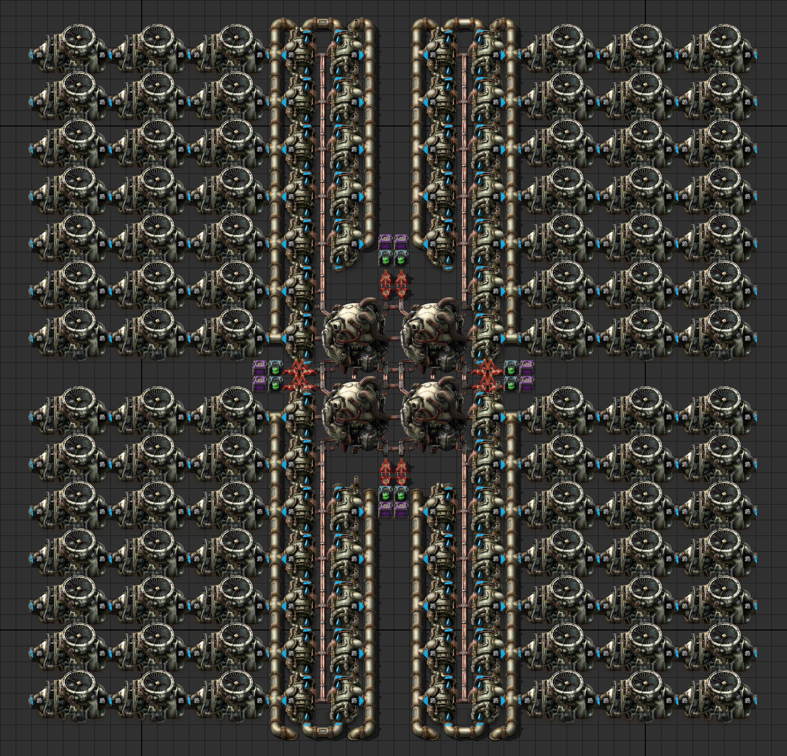
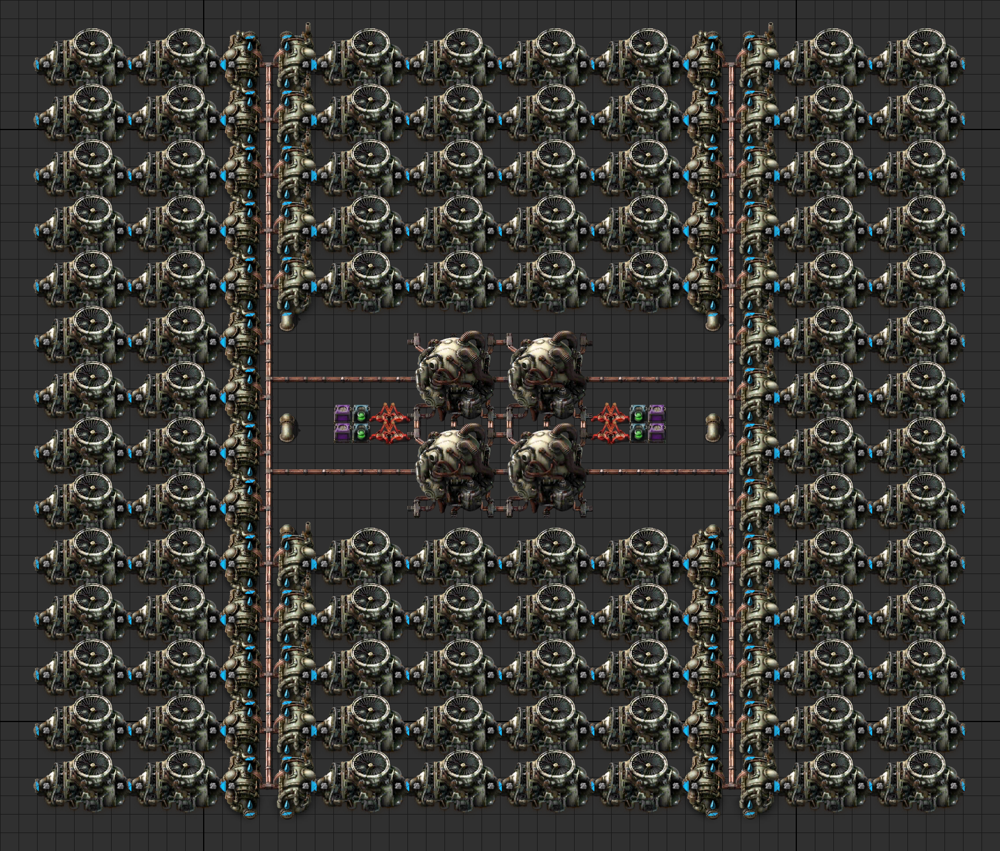
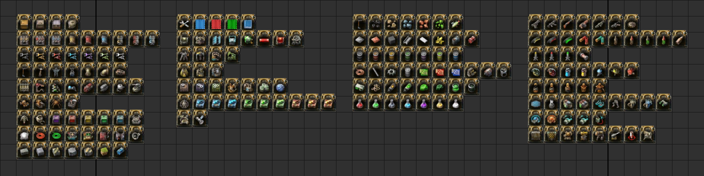
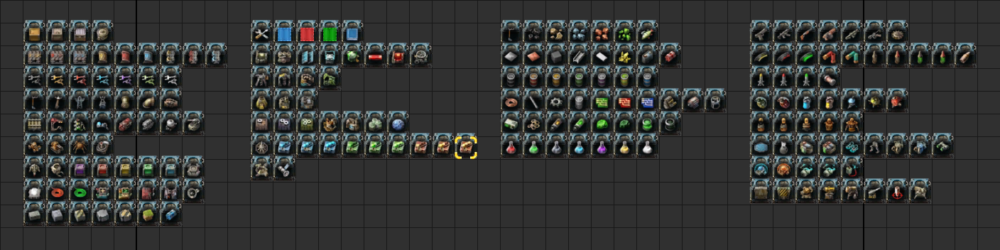
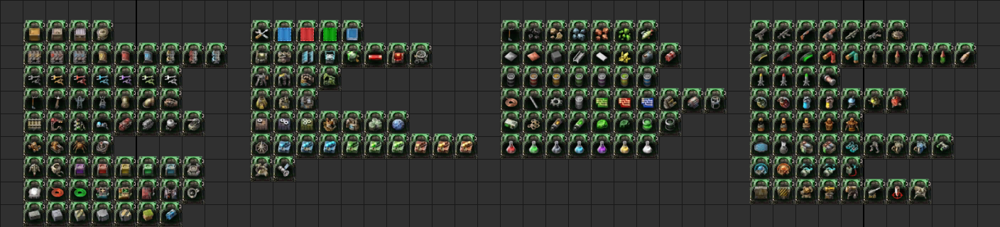

# Theoretico Factorial

[Factorio](https://en.wikipedia.org/wiki/Factorio)
by Wube Software is a video game released in 2020.
Factorio, a combination of factory and factorial, is about automation and logistics.

The game developers made it easy to share our factory designs with each other
using [blueprint strings](https://wiki.factorio.com/Blueprint_string_format),
which resembles how we copy and paste codes from StackOverflow.

## Nuclear power

### 2x2 nuclear reactors in 46x46 tiles

4 nuclear reactors, 48 heat exchangers, and 84 steam turbines.
This is almost 44x46 tiles and there seems to be plenty of room to spare.



```Factorio
0eNrNndFuGzkSRX9loGdr0CSbbLaB/YX9gUEQyHbHEWBLXlkKEgT+95XHO4nj1Z0+l3rwPCVx5KtbxWJVkUUWvy+u7g7Tw2692S8
uvy/W19vN4+Lyj++Lx/XtZnX3/LP9t4dpcblY76f7xcVis7p//tfmcH03rXbL3bS63m93i6eLxXpzM31dXIanizN+O5712+ms3+6
fPlwsps1+vV9PL0r48x/fPm4O91fT7ijaD5CH9RH5YvGwfTx+eLt5/rIjwHL4PV8svh3/EuPv+emZzBuE+AvCcr9d3u62h83NCaz
yC9bF4ma9m65fPlBOIKc5bv0ct34OIc8h5DmENIdQuH6i1k88gTzMcQtz3OoMwizAOAMwq53QYfVEz3rCnGnPWk+IMwiz1hMSlq5
4Yx/mTHt23oafpv24n1b3y/1hd7XenLKj2P0A6xC5gqFDNqEHDu2yrtwXBqHTn/Ph87TaL6ev159Xm9vjf51whorbKWOOHefWCT8
dfuU261MVTuQyJkf/MXF/prj1HEIMYczYJyqEghGUGANWcbKsqBITmLcAbuXFMYDUYZ8mVJ8CRhCypUj9i+teUsLIpk9MPUV2HXl
qiRFhQNAtMQJCt8QICF1tB///wCdz3RE7+FBFsstjRBgFhBkjJJVo4ig+yY41bBx7HiikjJlDKPFwpJAIA0ZQYlQ31jCD7u0gwUY
ud1YMU2Ln4MEI/edIA45ESBhBidL7IQvqOvshCyIXP2RB5IF7wUEolC8EQhEQo+kABZXSmTiCTwncWSkqkUMoFgl7K4XQYwQlRvY
mviJSPBjFZsCzXxGpGEFxGFuSvB7tUHUtSR6DDi1JHoOOfpLXk5g4JO5Y+tODNfQcIguIbPoURaWYOIrP4Cd5bBwr91hKxpFDCPF
qh12WQggYQYhRo53kIYOuyU7y0MjV3vOuSmzT1yv9F+xiFRHu5hWH2pDkMV2PDUkeQh67hiSPIYeWkBUQdGwJWQw6tYQsBt37ISu
QGT5mHm+SqBEVDqHKTIMZahSVauIoPqMfstA4hq7jAUeW1IxkPymMiGOOhODZvpSkt+MWsurQZTtwwfEz1wVS8sHDkYPAlweSyog
hFIvQNUQvpvAQGsIXhI4N8QtCGysBVWsMxlKgUxjuWkCScRcDkhE/1aAxjMRfCjRi76UgIs/8lSTR3KaUONHDkSLx3UpJBZ9c0Cx
aylIVTczYUpaC0C1lKQjtl6UqipORl6VGdQSGl6WqgjDLUhLHLEtJkfyyFBvHV5Xcu+3t+nG/vl5ef54e98vV8de+TMuH3fbL+ub
kF3Wz0vOClYQoGELqDlesJAl8ak1yGJvVPKvlvnNTVjYT35Zm5zNWZnK9Fxmk2MmCUSPT4+AgiWSKIDkUP1mFuh78XBUiVz9Vhcg
t1YGMoHNLdQBCt1QHILRfHchohme+JhjUkU6+JCgKwlwRSBxzQSBFGpSv3k3/ORz//Ptg+FIz/t9HP35a3x0//3IQ/q+z/T/gD7v
VZn24X346THfL6+nu7oh7vT083yKIaRyeT9L/wNlt7z9eHT59+hNsvztMJ6nXV9Q3t8ujmdxMN8v15nHazdAuby2mP/kFY4Nu/hG
qeVXXZqoxNVPsaMkmf/GipZocxYuWam4UHC0lAo6WUpSGaAl13RAtIXJDtITIfL0kCj1h4OulXkEEeTXo7y6dKDRz1SQFS83uUEL
2XNB5OXOrT5L0vM1gCYOrhxIB7wJLk2pJA9lNltqSBkLoljQQQvtpILu2VHkaqLbbK08D1WSodoEEqg3X0qVweDZI2WrDSXwm3dh
wEh8hj137zlD966vUluyrcrqRYw+vYd8rkXxVrodBpfxKe1bxdtTK8gtOzvexN78gmwLkhsH9Z4xtMTVTTM0PzXNqfkpVP15CTzD
64RIhx67zoyVEDud7L3UZrYvnOK93tO/YpVbfxe5TdvahoMjuouZWlwjvupaG5YvqTvDqIAVeIkisaiZFcHaMjRGAmUHozggA7zk
/Qmj0/8zMQjzb/cur1sneFGGmEno7dYXA2c5cITA+/ZeUMvGNHjVvA13+SgB6BErJEDs/HUA7TjEGPx2AyNFPByAyXuJmpU+8wu0
VQnaDI6rixOjVPaSAQ+tmWSYb5DHWxs0uCO/e/mSGk6zLn0q3uEuABKC3PpXxJT8+QAX58QEC+/EBAhffM1aGPPieESJX3zNCZFw
/GFQHFFw+KAohuJ4RnWCJZlMAKWCyYKSUvXuGi40gbwsgBSytrl/KelYN/R3rxLGnZ72kMsfGOKd0mbszau7vqcoczINpbFZnqyK
uhim7FwnZZMzWPUI55LRILqWjRQ/JYLDzBaggvxQCgf1KCAMuOL6Nqj0X7nlZFYIXySQRL5JJNriXjUTAMUuKUs4/uCzZ0RPDkhw
NIpLB+eeFFfRgrWiUhIN1TURyocsaSYPeDpEMen8xwG5cxSH7qwEKXfzlAIXGe19B9hLE3WzUfZs42G0t2TXMWL32NpJg9S6ISF1
Vu7clHMeKe1tqGbGb1+LR3paaBO1Ypjm4vS2pKVm9LbWAowUjO2R2Zj4L7WikW1dSwJE6eS2bv3lFpfN3ryiyv31FkRv2r1iTizg
2bGBR6IYdLAqNt7DUdfHU4RxfXVpPnb2JxTrepM7L/bWMXvKvBbX3sdg4pg4vCrSM+LqgFo8m/5oEzf41h9ENWcyUgh0k2MgFazU
gFResnR2pvUAXBZoIveagOWQ/ZEFdFz9kQeTBD1kQma8IslIod/K9arRt5v6KitnXXvPB/S01FZ7lSxa0waUmgZN8ycG6tqCJWC1
sNBt6eEMToac3JIfUcHwDNhRPDec3KHTDAQ4KjU9wqK6jKeEjHKr1aUr2GQ7YjD15hzg0Qa9vmdZVtZM8OI64v6Xk1uOOZVJNPW1
wqUnQdmWaQ3KTPGZKvVWC0gJarSy1lMVNOZkd9fRSjhYQu3kp2+gneUw63qjAddG8T4EbV3JsuIAAHwVJDTcQIHTfcAUBQuNOlqp
Vf8r4LKvq1Z/yYJ/JR6eZU/ZaW2qCXud6qavSuSELjiNvZa+58VRfqQm3stckcKYvOWQzZEFT8nrbawEH97YENABvp19qD68KlIA
Dfa9KcuBN7F1vN0T/ogBETv5NAYiMVwTy/a8BO3n5AJjZ1l7j4EaWGgL3sdQKoW0sJQncv15yqNZ+pCZCK1cagW5FalG4iaq9yDd
FWPRgLnwvd7Y6+9NqJbuBPpmrIar/4i179DTVkT7HK9mNeLmqIehyVSNE+9VbaAJjgi/yam49fDdXI2T4bq5GoAcmNcJgv7wLbXB
seInhBPKHi5dHvC9fvVZ+sbhbXU13x5/98fx//3pzYfXDb/9++cFvffnal+PHv0y7xxe8GvphjEOttYwhPj39Fyvo2ns=
```

It is possible to make it 44x46 by giving up some symmetries.


### 2x2 nuclear reactors in 42x50 tiles

4 nuclear reactors, 48 heat exchangers, and 96 steam turbines.
This one is more minimalist as heat exchangers feed directly into steam turbines.
There are barely any tubes.
The underground ones you see are such that you can feed water from just one side.



```Factorio
0eNrNnN1O40gQhV8F+To96m73n5H2FfYFRiMUgmEsBYd1nBEI8e7rkF3IjFzrcyoXs1eIkHz0T9Up53TZr9Xt9tA+DV0/VtevVbf
Z9fvq+utrte8e+vX2+Nr48tRW11U3to/VqurXj8ff+sNm264HM7TrzbgbqrdV1fV37XN17d5WF3zaX/Tp+qJPh7dvq6rtx27s2tM
ivP/yctMfHm/bYZraB2Q/tutHMx6G265vJ/bTbj99atcf/+tEMt5/iavqZfpI8yVO/+GuG9rN6Q3vM/wF7GGwyxS4/gB/b9ejaZ8
339f9w/SXGXIQuGmGGwiuI8Yb4YXg1iHhO0dxM8rlsAXFcqvQwLsmbtpcMDiLcwMxXAfnG5kVDs43Mo/dL/n21D3NJvFP1DlOQDj
LmEgOpwicxA1HwmSFfiZo3YtCQDFywytoQpLGW3Jv8vyiesdLMTRz73ktxsA1L8YYONBqjHEjLccYN9F6jIVW5tJViqxCyzo27Ya
XdQhcW17WMbAjczXNr2jtuY2RMGyViQKHrDISJipkvYbWPSlkHSNnXtZrJPfqQu5NEBa14WUdmnmwvKxjYMfLOgb2tKxj3JqWdYw
baFmHQitELl2FyAqJlnVs2pmXdQxceFnHwA2Zq/X8ikbLbYyEYauMFzhklZEwtULWLfQlPyhkHSNHXtYtknsxkXvjhEXNvKxjMy+
8rGPghpd1CJwsLesY19GyjnE9LetQaKWaS1chslKgZR2bduRlHQMnXtYxcCZz1QorWriNkTBklRG8nMwVGYmisLAzZIQqLGwMzFv
YGUm7HLhtETytHGlBx6adaD3HuJmWc4xbWDXHsA0r5hC2WFbLoZgqjspRIaSKZ5Ucm3NNCznGDbSOY1zSvBZcrMJ51xKFrCmCc1O
4kiJRGl7EA3Q+ZHkRx8COFvGAJFzjuW0RHKzmMzWOBDPuzMOwO/R3syJ+xvppgGGOHGAyCebMAGnitBeAbTdvBWBc3gnAuOQlmuC
sOGvFLgO5vHoJ5nDYIouzBMT5kcZzLXE441nEaIxn6NDPaoxnjKwwnrEzeNJ4FkMFzAW3wHHg+aZd4mCuWLOEwSpFWcJgGZCXMNi
Xj7SEwS6R4hIGukRapECXSItTgsJ4cX2hIF7abOyIfinyPPalYCkPPCbhS2npObdJxPBuE9aYo3CbMLDCbcLArNskrSjpNkkY8lJ
GMK3c2Vk6fkkswj5TYLt76PZjtzGb7+1+NNP1TPejNU/D7kd3N1sEyxLbS+yh/esw/Zyl5jPqqvrnnTf33XZ6+6n1899u1g/6YVj
33eHR3B/ardm02+2E3UwrMh47Wpp87B394Ay7x5vbw/39O2wcDu3syOuzkfcPZkqgu/bOdP2+HeZHnX4a9WIvWmD5UeLPXnGcnft
j/MgNP5H4xI0+K+LmfxE2RZ1Mi7nU8N9WJVbg/GoRozCsDabcQWFZo2jetDbYZX4gbWsjLmxUCLyxiDfhQrpc7+WB50sE3/zO1A1
Fq/gG08yzjgZS8g2mmlHjcBjpKjIqLA4Z5pXlCFzbWCvrEbq04YKC9FvDOsaLK5KY7WeNF3BJAlUqcm2y8hDpPlmwikS+URYkJ75
TFiWTTUxG+iKTOMtS5pCepagvKXDGmAyKnDMmgxJljcmcTHljMqdQ5pjMaSh3TORgLROfJVDkOMYfkzGeMchkTM04ZDImMBaZjIm
MRyZjEmWSyZxMuWQyh3NjZI7iqNYE7JYnxWEtiuaPaw10XusKeWBrpLOfwvmYMoc2MtE15J1MlMxbmSiZ9DKNdFBI9jnIHNLNNMI
5t2s0dqZMc4qLUhFGXuiIHEW/tsnYPZCKhm0UzXdsG6gXyzVky7ZJ0sLyPdvo5PmmbZTMd21jZG/ptm0UTPdto2C6cRuLMG/JGiQ
EmLd8DQJnrqhBIFlRg0AyW4Oku1ctWYNEDluDinSjNueIyxyVJQ6ZXN6pPHGQrTHFIe/MO9YVb6S15du54enzHd0wmm/qhtF0Xzd
Mplu7UbKnu7vROPNcg7cYZt7zliE491rhGYLooDANQXRkXUMrrWwibUMRxNYh6cYsT3Z2/AdIYyZgt8L6WuMmoGyFnYDdEu1r1k+
Q7nb1da1QfnD+QaH8IDoqlB9EJ175QXLmlR8kF175wUBryCSW4ixYXvqxyQenkH4Q7RXSD6LZ8xnp9nkfArlFIoiuRkEisdVIBGW
N9INPTSoa6QfZjUL6sYccRcvukuCc+egU0g8+OcorpB9E1wrpB9GBl36QHHnpB8mJl34w0Mg+ATnOFI0C4OQ1nQLgM8o0rQIgmu4
VkBw0ullABNHVSLKNEluNRFDUSD/22NmUNNIPsrNC+qHnjfpU2F2SvLTUKKQfm3+2CukH0U4h/SDa89IPkmte+kFy4KUfC7QcySS
W4iwnXvrByWeF9IPoopB+EM2a6tIjbn0hXfUT6Nvq9FTw67PHn6+q7fq23U6vfT3+7Y9fWlK/Xf15euEq+Kvnq2inD/xoh/1pksW
F3EwrVkpqnH97+xvfE+ga
```

## Everything logistic

### Store everything

The filters are set so that each chest allows only one type of items.



```Factorio
0eNq9ndtu3DgShl9l0NfmoHWWAuzlPMFeDoIBW2KruZZEDSXZ8QR+9yW7E8/OYAHWX5XdqyQOTH/+iyySdWB/PV2mw6zeLvvp09e
T7d2ynT79+vW02XHRU/za/raa06eT3c18ejoteo7/mtxot932qr+ZbVfb7rwezen96WSXwXw5fcren+SD5D9ikOJHDFK+f346mWW
3uzUPge7/ePttOeaL8eH3TY31dFrdFr7dLZEiDKmK8ufq6fQWCH+uwk/y5vcjfMNvVzvtxj9+yHcxPwZ/dW4wy2PoMGTvjmi48/v
n+Ev+DSlnIOU40rYbM9GICgZRgRNZ74gSlQygjCPRfTS16+U5hVThSDljInmzauvVqvskUc0gYsyjwUTns/ujjyOpddLLEn58Aq5
hwDGm1J9eMsHTMngYM+pYR68HQ1WpY1CdBSqpi3PJeZWdcaqMYbtt1tOkzGT63YcfsbrJJNEY7jxjzPnehU0pxcLw49mZ6TWdT2v
D8OIZz2kuaRiGB28Zy83rxR4zSR6GA+84M2ddjScBMfx3w9hQ9Ku62u2WxOF4bBxnDSO79NpiuGvG0tpubh+PJUnDcNOchXVcZt3
f7GIUASrHvfSZM53niw5D0oTKcffM0Mm7/tnsatLHEgZP7rE57qcZm1nY7wc127RnzHE3zVhm1yn8ud+8eyUIVAruSCWdaQ/Oelu
dD6cQM6VvSZWAqgLORocPBzVll834nSBWLbi9AWKZL6s326ZA0RrBTQ6gu+owJIjWCoQD7Dm5ZVS3sBrNQDdqJ5ANYKPyFIwTeHF
mmvEIX/WjDzwDyZBFJricA3AwVy4QDTDi4z/Jc6soBHJVoC3JUAyXn3d8LwbbkhNtaXG+bZ3sTtGrFvBUyN1K988KnWGNwJgwHJm
KE3Gp+VOMbEpOzKVh+lYqVHkWRBcBqIuzE4EmE9DgR69warZhzx68nZIXwzIXBD0Rx+AmHaOwi0kjFYJQZwnF8/WszDISLhllKWA
CLPgRvINsWAlsCMC56zXcW71R6zGvSahaECAGrKj7/piPSYdBk0iNAAnQKcrzL0K+oWwF0WpAouXoJxNWnze6p8jEic4wzgo3o3d
lvvThbjGmfWjFCaJ3TKrVrkmXUHFC5w3XTe2HvxD8VJUL4vklHJVdw7pLMxWC9Aew7Hp/DEaFDVldtPfpfaYqBVwlmG+gKVUJrFd
Bc/zlDVGqFmRmSjTDTpOqESAh0Y/jErZjHTN9NKlaQdIIO0/ZQV0PAlEnIEKUsuNtByZVfeZntBChjul6JHeXOuPDVChMGFv3wXp
EnXJ+ng05tJjdu8kcsxr1RkUr+GiACYNDuA8doJJEDJ/OuyNPYZQXsyWBKn5SErDeq44BDqLVBHlS5Gqs40X9LUkjSJNWaI4rCdP
yYZBQhg1HcT+rWY/6D8Kpru742VtAo3CHmuMyc/MlWY105mdwK8Y6UzT7NRkfC3FI1vg+Xs/vAdiNbMcm59uxxIs4ULqCnQAv4RI
Btd1MOrLRlGykipfbVXqeXRKrYqflObMMk6xmp8OR+59eFkclatj1ApwtWUFsuMOvJGzflybEiHv/ku80ELIW3wUYhy3tdztN4Sh
BhJJUqDdIHZhNs+QClvp/WvnZSmrUG6hIxS5xzGTEuC0FBQ2g4dS3PokUUiUQCbDfbIa49jADSgpnALaLHUGwRlA3UCP7YzpI27Y
ClgYpkund7Pbg4pNEnaB8oYaKH7dd30dJ1cyfBUTouutvd3dAWn1dJsjDN8hhxo9OveqRoFUuqFtokCPpYQciUiFQCVxuanfqUXW
SpCoFQtVYri3JUgkqFBrOQYVmuFpQFVCD/QXqevhF90n31DUCKESrbTPzZYrXm+812lmSrRUk4Ws0DUEVrBNAyQTL041HZ0FlQM0
oWyCKlp0zAZhMtSINlwvqBAC4mCvx5hqg0mHS7FwIigWQzfBmZtvrexou3QWYnUtBsQBywNKXNEslKBFAJAo/2NvrMRLmeS3IMTd
wC0fvlpjFUcdiCaZrBGw1XCvQ6wuhH/HcClLgNZiUj6MTujc7ARJ0h3hVg1nCQG/q0R58EJreWM2ljNuWmdfARcswZay20ow97Sl
p8EzUXtrg1VY0KEmPKTrdx4j1ejMUrpKf2YXPDW6Jo1vfHwSvJWk7bfBwaF5UaaSaXzwAiKWHF730ZqBL1fC5WFK1aaSWn3tGboX
BMZhti8c+0lbIaUht+EpF16B6Qiw7YzSlftQzIOvwXgRN04rRk/qBhGi1hZl+rIqhGcPRV4I7DyQew98zrvzX6e2Rnr64sDv6+MU
kWckvfWjQKjHt53QdcsbpWGUcBUdvFj0QFKr52XvEdzm7xWd99LodhAMzp0OVcaqZ3XDEDg6i5Vp+HUaD1rESkQRvDiCXnenYYik
WdVIxOlMZQq2P0oYolJqf03Gjgv/uQI08hHQ1sY+RPNcZHamMBbiFi9jgXulLsOAXzvBsmCYq2UUgiP3CwP7eUkKXqmLXgkATK4C
5N2Rm1YJEfYfc8b8Nft+a01iNAKuFMmBpllaQCwdYKG/HZZym04/kd4v0M9vgoOIVNf1A01mgT4eE0/7j8TjaNOL0n36oxZndj8G
Da4g1T+Ey9hJVTGNKHhzgY/45eAJP8vAAH2/V24bJKHnskbU2lDez2wkKVoJUNV/By3G9UnSTvEnAp/v2PRTARpDH7pCo6sXFZ2j
SQK0gWdzBYd7NTi7N1AmYgNl/Mbon7AqcttW84CxGYwZ1v6URXu6TZF+ZUIRsNad5NWfsoJvezTRZgsOqJElXQCgTHFTcLGPqh2r
DUpCk5townTtntbC2P0IxClwtSBDL4Aizn5OOrXG4cI4YDpyuFXS7y+jSbJzQTvVjlEtPulry+i9Ap4/dzfeCT7X11iy9IT16ndW
SJ4BbxrEHo8sFCVKAbrZhQ9CxxwCiKwQ55ZZRlIPRCZK4jGUBT7yKn54E8I49mhY1rKBHFtpcdSDCyAT9sh2SETR+jB031kyDCt9
h19kQ6sEkHbQt6zkpBE7QR9vCnc8AGKedlhH4GOzW37QfjbqH3jeDIApaawHtrsd2j2s9nipC+HI+H3tdzM85gliwsyoiIxOjM4x
m24xzb552Zec5psuhJVKxkyz/rxVSswkZzgWcevweXOQkEP7HLeGY8j2ChBC27JQVcjP74rZnM5k9+BiAjd+BK1IPszGjG5dxCVr
uBRwv9u6mAThJV248MmOtsJNOtwVlou7ceMnAOnDiQ1Lp852oLxeB6t3Se0PYF1h9uQXDdN4M6tUSap5Zbbk5g2j0xixEJkk7LmK
3m/5D+0HRzdcI0kGIWNrb/Tab+/huvtiF8iZnJurQRfAG09t7sQnA1knYMmTmxy6gQaG2FbXucgDpZJkgmQa5scler4r+IFfGauH
tGBPunqiPLwcCM07UzIvIFj9e5Up4WzgTNfIicj3qm7ZXu/fpz1YStfRCVN6NXs9zbF5S22r0MyFRy+rs5Zx17ueKV00xY8O/HkM
7pqY4B8GnUUEwxxIfzvXph8MyRhsvR56/PDVFQ8vP/A+mQtAmvQFMGfu2hh0pvnfUU7n4n03F5IrBgv1ebE+KsuSMPl7ONcjr4e8
1fZ+fHh8G/NcP+Zz0xUzha7/G//vHf0f6/NM/w1/MT7+8hF95v4XfNnxj+Pt2Z8zbrGy6vGnbtu6y/P3935k3ycs=
```

### Request everything

Requesting one of each item.



```Factorio
0eNq9ndtu5LgRhl/F6KsEMBets2Qgl3mB3C6MBVui1IwlUSFF93gHfveQ6rGzu0jCOji5mhnPDP35L7JI1oH9/XSZvdqsXvfT0/e
T7s3qTk8/fz85Pa1yjl/b3zZ1ejrpXS2nx9Mql/in2Uza7boX/VW5XVj1Dx9+Vfb0/njS66C+nZ6y98evGCb/mmGKrxmmfH9+PKl
117tWd6GOP7z9svrlEv7lU5Ye7fG0GRcGMGskCYOKovypejy9BcqfqvC9fvzTX0Y9h39//zYfon4OfzNmUOt98DBkb3w0Yfb+HH/
QP0DlJKgcDxWGUjOMqSAxFXgmbQ1QppKElFFkMlZOSuxyfUlBVRSonDChrNqktmKTfZKpJjER5tOgokPare/jSGKb5boeg/9XvIa
ER5ha//KdCaKWRESYWX6brBwUVKmOxHVmKCUuxiTnV3amcGUEC7pFzrNQs+p3G77JZmaVhCO5+Iww+3sTNqsUDcm3Z2eiHzU2rQ/
Js2c0N7qmcUhevSUsPStX7ReQRCSn3lFm0LYpC0Ii+fSGsM3Imxi1uyaBaF4cD7SFsU16nZFcOGGZuavZJ78meUium7LI/GWR/VW
vSgCwcornPlMm9nKRuwCKlVNcNkEra/oXtYtZ+jUMn9x9c4rvJmxy4SwwiEWnfWVOcd2EJTfO4df9as0NIFLJulGVcKo9OHC3GRv
OKGpO36kqFleFODt5G45yQq9O2R0gWM267SEEU982q5wTSOEa1s0PwTfKMCgSrmWJh7DqbNZJXMPKVAPctB1LOgQdlKggndSLM9G
YPnzVTjYQDSBzFhnrSo/AQ5PlLOEQprz/JXiOFQVLsgppUTAWaRvIO7pXQ1uUFqlp8YRum/UO0axmEVWYm5jsXwR2pjUsk6LxwFy
0aE1Nn2pgg9LiNQ3R20KxyjMrRonAuhg9A3gyFg/+aBbO1jrs5oPVc/IiWeas4CnGTZhZxnjuqtJQBStkWqIyBHIRap0A15GyZFE
h7PgZAERZsmJZEoFnxjHcdK0Sm1+2JFbNCjYjbCn73i9+lrtJL8mGBYXQKkr0d0AOo2xZsW+ETKvvZxVWolWyh0hFi+wQzhFXJXe
hvvXhFjKlvWpFC8p3RK5Nb0kHUdFC8Q3Vbe3eXgB+q8pZGYISHd/dwhpMUxWspApiCfbWD0qErVpcpLXp3acqWWQlMocBU6ti2bB
CzfbXN4xaNSvjU2Kz+TC5GhYUJm7iL2GjljGTCJOrZaWjcOctPYjRA5g6FhNGLT1dd8Tkqs+cbBlGLD+PPrnn1BkHp8LihNFlH2w
I1CrnZPEwRxq1WzMrv4hJOihcwYFDGDK4h2PwgJVkIvl52r16DqO8KpdEqjhpT4QNbzKGRoC2Y+ViMddpGa/3b0keViq2wubPkjg
tBwcTBNHhyG4XschJ/go499UdJ0eM0CncuJa45MxySdZCnTl54oqw5gTMik3GAcM4KK1sHy/1RyjXga3Z5BxrlvjCESxfwUi1l+i
CBOGuKh0TaUoGVEXLIAu5LCYJVjFKACizDSdbzUi8Y+6Lcl0NlKlhVCdQNmuBoqNsAhWH7mOZoigpO0JJdyEYtpayMxAOY9Luep7
DMQOIxaugbzCVaDpNk7No6v9pJWrLq6FvUKUxOkyr3SSjz23JKqBAmk/86OhIQVUsoRBWXNQQ1yHOjLyCHQTdRU9ItIZVpVBj9s1
0uLdtWTQNpjinN4vZg9tPMnWscokaVYjpdnmMkqrqP7OYsGuwvx7OAbQSu4yV828wRx07GXGTE0CvnFUn0WCOrV4PQKiCpRRy6Yn
diHutS5KrZIlV4zJ5SZqKVRHRUI4xMPPVrBqEGtkFIUZvV9kn3VXXsLAwejmnlsscr0If9eNZkq5lJfxrbGoDKlrHwuKJlqebpc6
sOoSaUCYBFC47Zyw0nnJFGi9nVSUg8GIGxqoxYKXDrdm5YJUmYDbJq1p0L48kX7qLMTuXrNIEzAFMXtI0FasgASNT+NZWj34CzPi
alctu0M0mvVljdkj4VQMM2LDoanRlQi8vgI7Kc8tKttfIAoA4PqAHtWNBoW4bNzGoNQz0Ju7Nzh7QsEdskiXczdSyBTJY7iojtsd
m5AUASbhnzDbZBl/tBcPi9cpiJ/4UwW5XBSErOflj9JnCrHF8bXsP8GK89tkGH1bNiyoNVXNKFRCCyeFVrr0a4HI1HDKSXG0aquX
kuDG3yOAmlHPxYAjaImmNtQ1dregoRA+IjGek5trP+gnMmjzKs2F6kXprP6Ewerkw5/0mCLqRnH/FuB+hBCTtAYRAwTi/3dPgFxN
2TRu/mGQrOaUWDbZOTdolXR+d0TpvCYfFyapVDgCVak6lAMaXGe3iY0Zycx5wrKZ12hLOPIsZfOw1Adqv5VR+NNjKWiAU6z0FzMV
o9nEwAZ1cpA5bgljbvZQiiiWWl3TUqeC8qVBjnoAaVezEBM96UmctYTG6cG0bzA2+HAtOwQ7NkmmmklF4grFiGNoe7S9wuSpG/Ql
qggU084aZYTWrKKDDRAZ+DH9s2mmwhgXWorJraZqWlXVH0EDe0ctozbOfafYW05+tg8OKl9r041RnlkYdJiD3m4f0YNOJ1kf7qRh
lnt+HD44iVlyFq9trVDINyntMgQ764yHHNCDvUQU64Cadw0nJewSTtErC0IvZASpWrJQ4XcWLH0eIdrz3Fuh8vx0+gdiw8uUdJjp
7MfHZnTRSy0pJd+iAsdOzSVN1LCrEOrgo2QN2Clr7bV5QFqZSgzjudICXDHkZXiIWICtOa8LNCTurk7uaZw1wYBUvsYsQSwWHFTf
RmFKCWrJkJcOplkxn6YmtuO1XqAbBq1lpaB4eYB3QUr41Hi+cMQaP52tZPfw8vjQdLSxUfY166clX815KRvBJv5vlKD8Vrtdq7RX
oqfCs5j2X3BIORTi+nJWCRfAtOmwSMvZBoPgKVua6JRQD4fhYiWLCAkFPwIqT/kQA+j0aGGteVq8vatOVgQnHxur77TD5RmWn2B+
k1TyI8D/0tihAPRqvE7glPaWFwWP1A7foPm4EGq0tmBAwGbTrr9JOShyBfKcwkKwWYYR+o3dHVOz+QBOGMOcQklfI8pJjIAtGpoZ
lamBch9Q0nFFu2vMu9LLEtDxqsVSMxM3/a63UDEaCq0FOQU4vMeaMEP7GrOEI8xF9wjC2jFQY5hb3zbgXNas9eBwEHaeTmKUgztK
krmLCdWk9CkZe9eG4EXi87uJ4rMY19M4y3cSUMbuM42UE1y0Un9BKn/+Y/cUYrN6svVWAvYLYX1wQDGjVIG4aUIlNbC/OCUyTVWo
FUvHaijHWu8pfpR0E3IgNK8mEEUxavV8XdXwHs1z0CnmtNGN2GmMAB9Xro7wFQdfx6DLMGog9S4PAWpjZgkxBhLNlrDQdyq3Nehw
F/DmyjNiK3BEm3lEQEN9RRMw8ZlMyRrr4oTUj4BXmjNmQjJHsXlnlbnrv059fxWxNRnFZM1m5LLHZSrhNyRdAKpjYoUw5CR1njpu
EGLPhXKhRO6mEuArWp36hcPwanxe26YfTMlI7MkWi3z2yBYPLz5wPAMPAzdIhqDLG3Q533Ph4JQBKxvkMMCJZDDHsRysAKD6Tk/q
RKVcmK4c/1hU+P94/pPn3H7Y6y4uaw9d+jn/3l/8E9fzwt/tvH/76Gn7w/Rp+5oc/rWZ/GK1ZHv7tf76X+jz/OXyT8H/c8fPkbVY
2Xd60bVt3Wf7+/k9A+5kU
```

⬆️ **Request from buffer chests** not checked.  
⬇️ **Request from buffer chests** ✅ checked. 

```Factorio
0eNrNnd1u5LgRhV/F6KsEMBetf2mAXOYFcrsYDNgSW801JSqk6B7vYN49pHrsbBYJkqpDYHPlmbbN/rpcLBaLh6Vvp4sJanN63U+
fvp30aFd/+vTzt5PX8ypNem1/29Tp00nvajk9n1a5pP8ZO2u/61GMN+V34dTfQ/yq3On780mvk/p6+lR8f84xTJlnmCrPMPX3z88
nte561+phqOM/b1/WsFziT34q/vtoz6fN+jiAXRNJHFRU9U/N8+ktUv7UxPf68aNfrtrEn3+8zbtRP4a/Wzup9TF4HHK0If0Ji8T
38fvOLl8u4Xo9BtldUMkIvwMuWcAlHTgOpQzOW7F4KzqvdjaDeWsWbsExr3VyVmKX6wsC3HCAS4YDO7VJ7cQmR4i3ZfEy/HdSKTh
GijGNJDYj1/UYnI3esdAZrvzPGA/Q9ixahieHbXZyUjksPLCYz4CFxcVayJ+LM4e5YHiFX6QxQhk17i6+yWaNgsBZS1/BmImjjYs
4Qspa84ozcw2xDrMra8UreEvIiqGyVrueESKcXHVYYNOyFruB47HbphyMy1rrOsbSLO/iqv0NguWtbnTYLY5tsXjAWtoY4cDf7D6
HFWJlLWmcYBAuixxvelUCRC45K9qZM8mWi9xFBiOXnKWMYWNnxxe1CyPDGoeHMp2Ss6YxkoaYk01i0dg6UXKWNEZouJr4db85ewe
NW0O7+vp/J97jwuY362IeqQy2r28g5oaQ+wYX03ShV6/cDhq6haoRBEOrr5tT3ouMBu+gygSB/SrjoBnBe8joBE8xdp3FLUYQNeV
xlwEyOYE8B23F2tlVZ6aDhPiqm12knWAXqQqojEVAz0pdQgYnuMfjm1l8uqogUzdEL8mCzFoey4EftbN6Ca/i2dPp/Wb0jtq6hWg
bSjVAji8ip2d3kJuQ0bMw86qeLd+1szgJr+7ZMVeaHMj1GTp3ICBfrDYgawGx0lPruN/SMXOanDZQoaMuocMSSqizRqaznVVhwBV
0RFKTTiflItQ6g1vbuoaICb7xUbjP5h0N5B0EdHu9+pt1Smxh2SDkFjqUIviHHMewBCN3i4WODgIm2DiZ9hfwbLXuofMzgnnXMBo
VI4ZTckRNzKuQMvK5m5K7UF/HuKOdsRWl4R36DUzmTW9QkGt4R30dNyzvwV3AuNyU0OlkTT7r2WKswIgr6CCYECpGFyYlYlokLtI
5bMVuaoi6Jp6t4lZuIL9oSDPv9S2XlVvoBLumqrZwM3cQMKXGGC4xKZJJiYGbuYeO3mn5sp7ENYC8A8RLsbKeb3smZ27PiGqAYuR
grgFap9sCQW2oqHF0OUa/yGDjElE6UNJOtTtrVFjELH0O8AoBJzhHDHHH4BEZ4mWtf7x6kYmjvCoP4TaIpITgF3eZyogZ/AHSwFD
KRDKVtN4gVkgC01B1BBBqj6BSCoY6bvHcIhY5y1/BnL4dEN0Owb5x17+k0GCXC6T3PSPanYYRGwTuGV2BQFMCsFZuTIWs41jHZ/G
QrkQ8pKYLEnOyV4BsqiaL0oS/Kax+2NUAcMNT9Qi5LBaCbgCpF8e785m7BURUlHqGXFebg7cDFGqcxEhkI+csjg1C/h5Osn0Czkp
Z88NgLu6es2Iykmnpdm1MTPcyIGM3ADuKSltjpCVE2v5hN0167A5gR5Jj6ujGu4VOqfoaEtgRXUL8uOWKADeQgQmesagpxYt8roE
JSAnkFz1nxO4gpVpLyUOwo5++h0g7ilh0tIvd43II8Q6QnK4lXZjwuzxGQW4sniFeaqwYb0eAgyPGUEDaro6SjrrZirucQTuXkI6
uo2xXgp4yAFeQhYkhQuxWPPSVEHMNGbmlqR0g0gZSzHWcVBN3iRbSobXEm6HiGtwqRygcDx2ETLGz92q5mLTlfr/HVkDkPSTsaql
HrjmMPUDImLFL7BL8GdKitQwZXQaDF+cCwsYsXmHoJaRMI6CnU2OnrhEZO14pzhUkT6MkHTe16FEeQgisi0ZxriF5GiWBlheMtIF
EaRTzxrd2+hpmcPa1kPaoI1/cHe2aTrtFWDXoFB1E3pLVaaO8gN0+zj0knGqJQq80PthXZYCASTvXu5jUGgd6E4+GQQFs/MBsCsO
oD6hli9T4OX3BbAdTsCcjKp4qwLYwHV3tjCNjvWGok3BO0PebQqlrRNNDzu3smsbXbgxglMbaxXT0Y5SyajDgFpGrEQwtp1e5jmr
KY+YOoWaZuceAe0STRKlyxFCnvE9JP5xy8BrJdHwrp2AnRvB0rWA1k/nQ11Fix3EVDLczq5fMBzDFzj7Ov7CJzPZmLYoNsA/PZnj
W2sgojl3N20O2dLExC3HpRYi7RqR4HVXDLd2C3bcqeJ1mGBuB2alVTqB1W0QRRonVVvvUQFZuPoBbLV5nGUZeutgppHu7GXyiR1S
DHfVWTQZgqK8aZQNuQhpM5HBmVkcZhpG3h9QuGVksL1hlt0J6q7WUdr1XlbqEZJmBrE4yjKDhjb1P9p4nbFSIgJTnHRhvDQgaKZ4
Rh3bHNeM8Zm4AXSPJoSO2fcvl0S0k/hoo1bAfwx8JEgbdQdA9SWWAkfaQgopAivZ7L3jNYj4kUz2l/5GOATkVZLAmw2fItgOlWP6
bhu+4+/L6xnxYmjPnHsPHYJdUxZuzr+kvgH0IrKka/0P8eMABBo81V+PDb9L7fH8C7KESrBkbh17sDlq/gSRMfOs/yDB2rO8an/2
3wwP4HaRvGiinMReb2pJiuD0kExrIh0deG4sRDxAxYU5elBzBFZTXbqasOAFEqUkcdQWwUz+mrGEigyomXtOZkpGpeLkrYzQYoBt
MUEMwsookKSlJR+Q5vKOGxEtc78AUV8zWM30Oa6PoLSQNwtDBOcmT2rR09JjrTSEvew/13cLYMXJeebXJY3XM2VvsiUwEdhl2uxx
XSIQftVpHBT8erWixxzL1jMQ1H3sJyVsI7IuOi6dM9z+zsVeQmqhniFPzsUMCHcZkzerwDSIfIcCHPTlNTpeBetuQkhgZefNxQ31
uBoomQ7k53dHWykwi/obeFgXqsbHONz2rJXIudKj/TU/uhZQJm9cGh1FAnLQfb9LNShyHgV7l+gBQSxyC3a/BH5XnR1PcXPQlQs+
erctLmesDVMAJMuQ+GWqgrCY5BadKZHahlyXJqLJN3AY4UP5/mLctwM8IlxldHumdQ8nH4nfsGlPJ9ypuLv4eONqnVAu+Wv+ijNp
j1MxEjnTOgSyfz3tYXXQYW+/1EBS+6mPRyoSOddNJ2ylakxojsYvkBdhVJ21eabeyU7tjLH8H++lQkEe7jk6Bayizn07FcAqnJnH
X4O0tZjudksE7O6XWDMRYGx2KR9zkr9JNIo9jdNDBOMXQ0un9tqjjHexy0Sv6ZJAC7KxDgZ/UqA9pZCbyASMvKPMx3RufRE6vAVv
ucPDzcBeQJIEUto2+XkWeltMFs/XOwHD0Q8CVngWQydPBJjwUk6cHLV/BJzoVYAMeiqkfKmB/1/uIPTcebMVDYnZ2dnJZ0mV44Tc
lX0CZDbMjDydbPXK/u0QdpEOKQaTMRKLhrkfKhiTUsKZHDjmscXbBar/DMe2/NETGwUtW8x2OoY30mYgLoL5AS/veu3floC6Bqg6
TOpXV9uO6IlzLLFn9dzhbcycnih4/flfvakmVOBPU5vRRhDDyokx87ef0vb/8J+DPT397/PPpr6/RYPst2urpT9J4+5Te6enf/vb
j7T//Ob5L/CV/fNiyL+puKLu+79uhKL9//wcPRS5/
```

### Buffer everything

Buffer as many items as possible.
The need for iron plates, for instance, are set to 4797.
This is meant to be 4800 minus a robotic penalty:
Logistic robots like to carry 4 items at once.
So if a chest has 4799 of something, adding 4 will lead to 3 extra.
Extra items need to be carried elsewhere, causing unnecessary traffic.



```Factorio
0eNq9nd1u3DgShV9l0NfmoKXWb4C9WWCfYhAM2BK7m2NJ1FKSHc/A775kO864vVFc5yi7V0nsmP58iiyS9UP/tTt2ixm9Hebdp79
2tnHDtPv021+7yZ4H3cWPzU+j2X3a2dn0u7vdoPv4r86d7TTbRjUXM83quJxOxu+e73Z2aM2X3afk+W7zGOlPGOPwE8bInj/f7cw
w29maF3Gu/3j6fVj6Y/ifn5IPhrrbjW4KX+2GyBBGVIfs1/xu9xT4fs3DN/Lm30v4/7+fbDcb//I9XoX8Nvajc60ZXkYOQzZuiTZ
LD3X5/Dn+lO+gUhwqxaGm2ZhOzHTAmQ44k/VOLlOGIyWMTM7rs1GzHu4FUDkMlRITyptRW69G3bxhysoVpgJnIuZTa6IHmv3SxJH
U2OlhuA7+ild9F67E4YiJ9ber/IinwnmIWbWMZ69bI1apxqn2G1RSR+fuP4RK9jBVQthu6nXXKdOZZvbhO4yuM4KFmOCuPSFmfeP
C9iSgwX16sif9p/MifXCPnnDucxDh4N68Ipad14NdeqlEuDOvmRk0jsZLkXBfXhLbi35UJztdBHtLQvhvHGgMA7ubdbZCg3tvYpV
NFzefl0GAg7ttZoktx143FzsYJaJKYbe9Z2Z1f9SzEkuVwu6aUMq75t7MqtPLEMb2AirYbRP7WzgCtKq3b93k6nJLYa9NrLZTF/6
cL949ijTK+DtUJoeag+ueRufDsKabJVLlPFcOnJkWHw5wyg6T8fOtXmtgBX+/AwQzX0ZvpknhwpX8XQ/gO+kwIg5X8eIBVu3ccFa
XsDBNC5m25qUD6ACiA35GP+xJYy7ho/7sA1H7zpzreAl/iQfwGLKUFw4w5csnkTl2OPCS5aBFESx8G0hr3qsxFiViMxVOOI2dnYW
aFTxRjtzBdHOviJlW8iaF8RAuIkZT8FMNMSgRpylJbwtgZXs+KglgHZ3tZDwJz4MfzcLR2obdvPW2k4RqspQPlyJuwnU6RnAHI4I
68GHSDMoJ6F6Z4fzuNrIClfFQgBm/Rf5QQ+a8IQE8dzqFW643alz68W+sOl+hKvgAM2BJ3TRLv3R6dqIFWfJQgFRRoT9ucharKlV
8wBtQaViazoRl6I1ubpRanfJERIc4Q1yMnpX50oQbyFnkUXMiFF+TXKMdJaHKnAjAl6zLmhd/FPmsPOXTAhkc1B3DApSEdfIDn0k
B1l/jl9aosEuro/b+7cazKlfGg2Vg3kIsVs6bMIfm+sMTJlbBJ3kyNHEvVqvkoZCAyXIMW7SOqUOpWhWfgMLOWbZVp0V0zMprngk
Ry54vMzS1ij2dHkO0WrrTItluioTGyVGcMLRuggnFUqV01g45ypjZu84svTrrSc52oNkAMwbXcB05UEmqQ3AXz12muzDKg5kk0yu
ns5yACR91jIeITcdnXpErtI5X+qe3B+Q1jfjEa45mzCQ4FY2DBD5sOKn7XvX6rP+8Oe+tg9V0ShjQKdyz+rjiXH/8eCqVezotnBM
rTomNWCY0GOKerPFNvMhfo7cTYswypY2Z4VUiBN+BTa1ncPmBmi7mbRxkHSpjoXIuZ6x03zvBzlPmbM6fmW2wbAWbakfuiXoYHMB
UsvUIzFatUDp4D8i30L0uU5QS3hAy3oWAbBW8MxBHMe1n23XhlPEea60idkORfIkUndlO4DSqlKcp/tdFp9WGMvkSqoWxYVLNbvz
4sFFlfMEEaD31tVtDoFPO6wQYsTdtXISwFTcU6AB0R3vG0Uq+KqFANs1REluqKp6mRIpxGte7Ofj8j6vRqpqvjiigmstp1tdRPjZ
aveeZ0CXYXK6uQboQ64RP8ZfIMcefnXrUZycoBa1TviqiRE6si23FTAdeJ3Ddqdmpl8IWif0yXqsCS9xJaHK+/KFkDjBS6xV8vUE
B9jqo0+IH3UiceV3yWIhc02T6YxfvQK914omEruKz+wWazQBEq3msbaKlkv6M/Z4vOiiImgi5cMk+4dG2KXcQ4aV8DQKAF7Mu3pw
C1tsw69rpOdkf+EIEZIO8mN42+prWu2lSXOXK+EIE5OiljxKYnK8+QEQK39fb03KWTfeCT12XcE9J44aYEFLLYEXmK3m4Ai5DaPS
xk4Qvk33Fp9YLMN0fB5d0Lyf7moeCbhmPqjVDGOhJvbQxL15QUJIwXbDElcz0YwCTZqsSpv01oWf/bXp9HWpDF2yJV3W9o1ppYt7
SCIvO+XPEerwYI4l0JURPbM0eJdwQB7e+WawkU5Rs6I0t8TBqeshFghV0WQIgmG4f9NCYFpKrpMkouSqRXBWd0kbujsFHmGmK58H
3m+MqWE2DEWpFN6Ea08n6+Pd0tQSyJq8V2O/0+gFUQkMhek1hzi+j4nTDXX++4VqECojvAUR84NQ9vaS9jy5smT5+UMKW0ZUVJVq
Spn3vPn6MJCFaa4lT4tmbQbeSOHRCtNQyUXFnp/g+kR6npZNxlTQXYLvetUtsJpFar6KrPEq0fFaKxD+UgNyGumWKJV/AxMLbZwm
pxpeiiSiV6u/Tj+U60I8lFMh7TicTmyyR+Y43zRLLcAo3tdY9QgvxQBfmcHYU2DBjy0sQG4Zx/bW1BRIrZ6tMoOkV0NwTOL8KPvl
fI6GAr2Nft2rRY0olD1ZBeTTBzKr45DrAcvsg3ipMzefSK6Tp2gZXFa+xHyMR3bDf9KmR2Nub1/DEE4lojf2mFzPDX8YOLiJWVIW
r2kPUUQS64X0EHvTra4wiwA3vJPCAo54mWMoNL1lSa0R507ub7qG1pZLzaW9ew29jf6zchgcUeL6vXyNELPmceI0EYo8uvqMjiMI
yvbUZQ3QNDU+2c4KJVvNMwBI4Gt3cbBFrGhH9tOmBWZLGtOp6f5M9SLghhUtiydLeRFttSuypk55N11mJ68o3JG4BqUwYK26eMWs
E2DHjc92sHUVJeKa3tvoZqgnxCj7RvA1PtgqIrG6B44WzRbtQfBXfkr+NT0RHBIHyn6OeaPIVG547Bvj0Mrv+WlqqpsaaoTHv3vl
ezzIVG948rojjEMyX8qlWgK+3YYvQsb8B5Tvw+emKKPaB+fiEMLFAmAmY02lOAHCZo4EJ8/ItvNCmqwPTKtsqHN/PWyOJRePPsfH
Hmq5V4Svs2Jth/vhBnmRDg29FvYqF0fFdvhXcnQ2REc2+RJiktVNz0f5s1DVsPxmMke/7BdQ7LdM1FPby1hIGmNKA9OLo71OM8cA
mZTbZWRrKwbuAE+Z+3c3K9n3Mu4PLJGcTNP+/VVKwiISLgWcf3RmMnAzCZ9wQDi6v0SYMsWIzXsjV7Yub7k1n5uBpIDi6K3iTfqi
Z8QZh4oY0XGtBHuzVXUN0GzqF40Eaa87ttKgpKdnSMRyvH1j7T3wGS1TWvKVXGMFq3NB4I3orLGGahQ+EAb1p1aP1opp0plc4JZj
O3phBTrWhRxix3kX/qX2rICOWfDoJEUx7O196cx3e9Uc7CB8bTba0DSOArWnstYAFo6s30CXIGohNSK0iLLyloZhBhNgSPiUHubX
Onk7qe8+KrW5PTGNxTcy7a+Y/PoWITbwtPcaIcvH3zZxunlD+gTU39Bcjkr2UTk2Pdm4uIq02dBpDXN6dve772EClptHoe1nWl+k
4Zg5C1yPHoxYas6Rv0dBGevMw6Q804n9ZF4SzDPF5YG9E9Td4ezEj0c1rWWK4dE//5i4ErtMTRpWw9zrstPHa9P+ebC2Jn+7p395
FgsXQwnwt8ZcFZVK8u5i5Lnnd6v/2Wp/vXn6Z8u0vR+300XThY7/Fz/3ju1Cff/nn9c9f/vUQfur5En7g8IXh79MVM62S4ILSsqq
qok7S5+f/AOlD2Wk=
```

## Blue-Printish Museum

A museum that showcasing all recipes in this game.
It only requires wood, coal, stone, ores, and water barrel in the logistic network.
Raw fish is not needed as the rocket silo produces them.
Crude oil becomes unnecessary once coal liquification starts.

The museum serves as a meta-blueprint,
allowing you to easily copy-and-paste any recipe you want to mass-produce.
It also functions as a small mall, slowly producing everything you need.
If you are not taking anything, it is a 10 SPM mini factory.


[blueprint too long to inline](museum-narrow.txt)

More features:

* The recipes are arranged according to their positions in the E-menu.
* All recipes are buffed by the maximum amount of productivity modules if allowed,
  or speed modules otherwise.
* Almost recipes are buffed by 8 beacons (exceptions are certain oil products);
  note that for 3x3 machines, 8-beacon designs are more space-efficient than 12-beacon designs. 
* The requester chests are set to request the correct ratio of materials so that
  the machines can continue working for the longest possible time if the logistic network is busy.
* Now that there are 11 electric smelters, the bottleneck of 10 SPM is advanced circuit.
* Solar panels help offset pollution.
* Coal liquification helps consume wood.
* Solid fuel prioritizes light oil over heavy oil over petroleum gas.
* Oil products prioritize advanced oil processing and coal liquification over cracking.
* Uranium products prioritize U-238 from nuclear fuel reprocessing over uranium processing,
  and prioritize U-235 from uranium processing over Kovarex enrichment process.
* Rocket silo is placed at the bottom center, the same place
  [the official website](https://factorio.com) and [Alt-F4](https://alt-f4.blog) do.

Here is a wide version such that the rocket silo is absolutely centered.


[blueprint too long to inline](museum-wide.txt)

## Useful links

* Official wiki:
  * [Materials and recipes](https://wiki.factorio.com/Materials_and_recipes)
  * [Technologies](https://wiki.factorio.com/Technologies)
  * [Achievements](https://wiki.factorio.com/Achievements)

* [Lab](https://factoriolab.github.io/) by dcbroad3

* [Blueprint editor](https://fbe.teoxoy.com) by teoxoy
