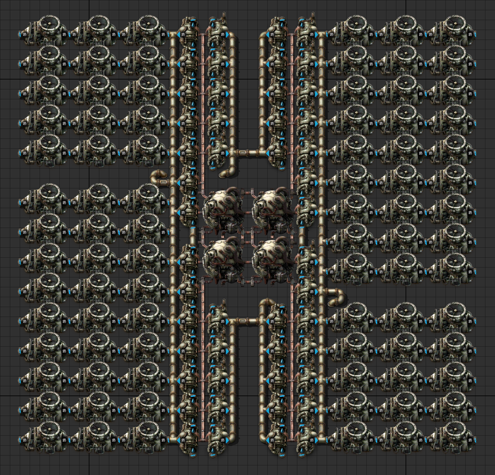

# Theoretico Factorial

[Factorio](https://en.wikipedia.org/wiki/Factorio)
by Wube Software is a video game released in 2020.
Factorio, a combination of factory and factorial, is about automation and logistics.

The game developers made it easy to share our factory designs with each other
using [blueprint strings](https://wiki.factorio.com/Blueprint_string_format),
which resembles how we copy and paste codes from StackOverflow.

## 2x2 nuclear reactors in 46x46 tiles

4 nuclear reactors, 48 heat exchangers, and 84 steam turbines.
This is almost 44x46 tiles and there seems to be plenty of room to spare.


```Factorio
0eJzNXV1vGzcQ/C96loojebwPP/ZvFEUg2xdHgCy5shQkCPzfK8eJdJY5npnLQ/LUJlVHu8vd2SWXXH2bXa8Pw8NutdnPrr7NVjf
bzePs6p9vs8fV3Wa5fv67/deHYXY1W+2H+9l8tlneP//pcT8s7xf7w+56tRlmT/PZanM7fJldhad/57Nhs1/tV8ML0Pc/fP2wOdx
fD7vjB04QD6sj7nz2sH08fni7ef6qI8Ci/SvPZ1+P/xLjX/npaf4GIb5CWOy3i7vd9rC5LWA1r7Dms9vVbrh5+UBTQE5MtprJVjO
EzBAyQ0gModHtE7F9YgG5ZbIFJltHEChATwCodUIlm+cd65S8JzDXpt4TIkGg3hOSrN07sVFa+8Bcm8ZtyIA9Cn5ZncAqSbhGhg7
ZhG51aFdqFg0jLgzApud4+DQs94vhy82n5ebu+J8KZIhkKzlzrHTZKsDT4bVslFMRTtR1TI79I+X7QGWjhB/YEkbG+ByhkRGQGq1
sYmjhohd1igtwD9C9HDp5yQESc3Iaf4lxPo2SFFV+ceklJRnZ5MRUq8gukacpOSK0EvSUHCFCT8kRInRnE/xb4GKtyyqpM8GHDhS
7eo4IPYAwcwQUJZo4SJ5k5xptHWs9UUAd6dYgUPXkTAER2B6Aq6F7NLRwyaFrO0loK5crK4chtbPk6dRBM9si0JDLrOqhcZ9l+nf
ZLsv071J0ltnfzSuZ7orbV4AlCH0jEBoA0ZsECERpJG8f4QB5GnrOE6gozNVHEEgK5uscgfE2VyN7gY8EaTwYJA3zVuppDXNW6u5
NL5dLo2CspROqSoYeMYgGHXRoV2pjh9sg4FJObOkOt30laQmCFi5niAwgpAgYcQoSRQqBEQ6SR9/tnoo8bR0pjweqIy3LA1OvY2U
5R2DkTdXodI+GFi45dKfX5zBQSivX1R67IrVNrkf2Z2U6jdpOp3kkQ6fSnct2nUz/LkX3Mvu7eaXXyX8EHSRo+QBonLI0aPkEaJy
yNOjaT1lvgEsR3tNd7tl1E+gRsfAZQaA2U2umGiSKdAA6wkHyGOf8yVnHUNFDnMCEC5VR7ANDhYpV+wKEXu1DTXS3hmYu9garbCc
ucf3MfQHUXPJ46vCh0rcHUBRWA1EGCEHOBC7xhSCnApeuQ5BTgZtkQjB2AqjXSFvAIwzQ7QhBqpBGhAiFcTcDUCL9VgPGMAp/qBD
zeg5Bm7ZcE61py6162bRlOFAl/bQSiiLfXMBSTGlLdVJgxiltKRF6SltKhPbbUm+Ai3ky6m0pcL4daFf3DAEOuEMy21IQx2xLQZX
8tpS2jqNO7np7t3rcr24WN5+Gx/1iefzfPg+Lh9328+q2+EUV1V5vWEEIWsoHaju5YwWFkG+tQRn6yWamVq4r2TeQaxQj8bI1yyt
WzeW0Vi0NrctOLYFBK0P7spQraFuWElYtpwCXpms5A7i5pZaPh9yEWE/pDmQJOk/pDojQU7oDIrTfHXgDXIxw2gk+J0rQyQlZ3xK
AdlIY9XylHAlxzA0BVKlFXL0b/jsc//l+MnzpGf/46IePq/Xx8y8X4X/ekD/BH3bLzepwv/h4GNaLm2G9PuLebA/PN/FjXVXPN+l
POLvt/Yfrw8eP38H2u8NQFL0bib65Wxzd5Ha4Xaw2j8OOiN1cekxd/AKYx96xzR9hmlFfWzONaZnGzpZa8DdetkTB0XjZEsUG7YZ
TwmjkbAlVmZAtRVtPyJYi8oRsKSLr+yXQ6Amtvl8C3aYw6o1vDjfrYbk7EsKxtN2WOOf8rAKhmbsmqFiaTIcQstYV5XrmqZwExfM
OgyGM3D2ECPIpMHSpKWWg9pKlm1IGitBTykAR2i8DtWdLnV4GouP2Ti8DUTBcts6FO/6a2eReOlROjgaom95Ld/1NjhI3SPoKlXr
8ZKj7+VXoSHbUTjdq7HYM+7sKyVG7XkwqzWuxqeHtrJXhFxTjva/NL8D4ZQXyhMX9M9a2MS2Dl7Zsebi1pDHFQ0rmmHO+FJlAz8Q
n+pKQY2UkYkvmWEGC0dkLPUar4q+Q12/071jZ1NK8kppa3b4UJFUosXIL5RMlim9dz3Gvb1/QdILRRQp5iwCx9DYbsGd5nfqJGUB
zgwBLByEB/M74CGEi/2tuFiBxyPQPn1rrbz09Ig36Wx+P+/VpAF66ikG+/QcK/shvhLQkbul9EAqgXoFCOkQ9tZ7sK504xWhscbO
HbNyENWWWt7jgQCPyh/4/EcCBRhzdIRGTo9TFidHre0AFWzfHwiUoHZDH6PYmTHj39afmOMl6/IlsK08JgADqq0/kfMYsAC+y9FE
AJhnokwBM/jLmAJyQpc51dMYAZA9Z39wFU2a5fwA6OlGfAgA6OtG4afKDGaUbLNEcCgAVlHpnJxiopbE5SsYK6mMBoILusceJ+qG
uv9RD/4194lird72gMd29FbNlnrKb+hNMeTnxgF5M06L68jrM+ykZLVN2HxJqwZitd4RwydUmOdRObXpACfRWuJdvst8KEYH9Tog
G3Mj5Ddzvi3wWQjuSqIjgZTIoiJfJoDTyLBuIIOcsqEqDWFG/uAylU28MQ+HUJAIl+PX7wgi6tXY0SMPWeiYCZVG3NVAM9XUIlED
evpw3A9qLqzi63SHvBlRo482IK7V89oXe20Q+BaEdy1SEsMdaas8wY+eNt4ECdt4DEWgr51JHctaRX+oIVEeZ5rF6jOe5EOrEMiy
DO9tSdSVrtiVWUBrcRB2p11+BoIAp+lGvHl1BBXuV5LFu/uGVqp1/eqUi+8dXKvKE8yttyEXsJxxgqdATTrBUaPkICz0XT3wIwgk
CdGxSZR9iaRNvUuXV/lhHr/jHitrnWNo6pooli3O+gTrKzwWxemrxj4VQq38sg17+IAsXXSnYSUJbuWDtBqDhgnWyA61HRx1QOpB
n3WMZZPo32S7po+5Nik76pHszryR90D2aRpVoQ/wMAXpgKZq1PxLFnGuP5ZHnW2JR9CofSqEOuMRCyEU+lMF6toAFsUbYYGnUyxt
YEPX2BpQhTbi+IQ4UTxPub6jQEy5wqNDyDQ40dTQl+QoHGn2aRk1ptcjThrEn7xIHFtCbW4ZtZcz3SNY6yvMtoWy84RyYmWq2q+V
CqOPKsAx6BwpZuOhKl31mwoJQwWzBQC0bWUsUMOVfoFAf5WAFZZqHuumDLE220wcVuBStzylw80rWyf98o1P8URBjjmU2ofUGQHC
lpvvZk4eB/kaifdwzBOhwpGwMO26AekWeyd5oSyygN7ke2upycj1PWeI66qPssWx6qY/MJI+yx0LIlT6UQS9/kIWLruTNtscK6q6
OPL3sAN5JP7SevCtACtKX+pQN9CH2Ltu1Mv27FN3K7O/mFX22Pfz9r1YmefgDYOZYe4wjD7LEEPIcS2wQdYwlFEKeXw9l0Lqz1KC
d2rnCCOpRJFZFd1F0FnnRhJV+MFf8vVzanT17LZSOem2mEJ2uYIQKln99jW5XE5Oul7erGELdrmIE/UeTsYXKPyPHXJwbiLk49SE
6M566EB0ZT6Osb2UL4yAr+qDeOn13pMi/85ef8L4a/eL3fPZ52D2+fKALddvHto59/93h1svrYX389N+nTz89/Q9bwJFp
```

The following is a possible 44x46 design that has fewer symmetries.



## 2x2 nuclear reactors in 42x50 tiles

4 nuclear reactors, 48 heat exchangers, and 96 steam turbines.
This one is more minimalist as heat exchangers feed directly into steam turbines.
There are barely any tubes.
The underground ones you see are such that you can feed water from just one side.


```Factorio
0eJzNnNtu2zgURf9Fz1Yh0brmcX5jUBSOo6QCHDkjy0WLIv8+djO1FZmnXJt96DwVad0VkTwXanOb35P73bF7GfthSu6+J/12Pxy
Su7+/J4f+adjszn83fXvpkrukn7rnZJUMm+fzT4ep2zyn03G874cueV0l/fDQfU3u8tePq6Qbpn7quzfQjx++fRqOz/fdePqAgVg
lL/vD6X/th/PvPJFS5z6Uq+Tb6b+0H8rTb3jox2779gH3uroBOwzOawm8voA/d5sp7b5uP2+Gp9O/eMiFwa083ELg5sLzlngitHm
o+MpJ3JpyNWxDsdostHjVzEXzBUOeca4VZL7HzXG+iVmR43wT8zhf5NtL/+JN4ndUH6cgnDCmFB+nMTiV9jgWBmfLrH5WaN5xwsw
KKCPznLlU0BuwL2lcJq5N7Z9Ul+ulGI3c8aakTalb68WYgQu5GjMu7kriRFRyPWahVWvpakVWI5d1NuxWL+sIvM70ss7AuZirlX9
G105bGAujdpnS4IhdxsLwTdt13tdo3vm27RoqjFzrZf0G7Mu9dSOuTWFMqtJ3cmHkBU6SVJvSQng70sB8t6ZxcR8SJ4K/HJkr533
nQru5YGQVQtexIt87bLy7E3O1wJs7sbwUrZira/+MlmgrF8aoXcYZHLHLWBhhm3ZhZeglH+/TZmWdkUu9rN+AfblXojeg2drkxqQ
qfSdXRs7fgMQpxbu1VIuCiu/WNC7uQ9pEVE4u6yi0KrSbC0ZWJXQdK/K9w8a7OzFXK7y5E8tLhV5/ZrmaGTOKtnJhjNhlDC2n1pq
MRYmQsGskhEZI2AysS9g3XF/a1ejl57oshqZVKx0nF4bNX3206RQ0OInLN2kSFncfaRYaQbE2Fs0XUw3awYVCqhEajRHw3jHj/Zy
WoA1X3aSlb0Tx2lCxGk27tihiTzGUm0ZrKRZF2JL9RBXofIhrA5cYYWBFpC78XF/CtehV57oshoLVXlPjTEinffo07o/Dg7eIz1j
vHrDwkQtMFsGaGGANXNYC2HLrUgDj6koA44pbNENZybNr/gzH7a7bjOnYbbbT3hfnP2HG63ee5RwWZGmSgDk+UXg2hI4804RnExM
jPKNDvyxGeGbkCOGZncGLwrMZKjAX8gBnaQqwOFmIw1SxNoRhnaIJYVgG1CEMe/moQhi2RSpDGLRFClLQFik4JBTGwflFQRxabHZ
EH4q85QG9UexCeeBYCQ+lpdPUJhOjq03MmBOhNjFwhNrEwKraZM2oqDZZGHErY4hW+ewsnW+JTdg1BXb7p/4w9dt0+7k7TOlpP9N
/6dKXcf+lf/A2wSbEdhZ77P45nv70UusZdZX898lPj/3u9PE36+dPT+iFfhw3Q398Th+P3S7ddrvdCbs9zch0Np5k2dk7euGM++d
P98fHxx+waTx23idfz558eEpPCfTQPaT9cOhG/1NX75466EUrVH5p8b07jtm5P+ObeP/jVyLenB3/09cRcfO/CJsmOpmCudTipA/
mfKHp1SYmQrBOWeXmvoLrJp+iddH6luwN26W5IFTfU3Niy4gCn97klk+byIvq9+u9/eAxiXsp+OmfTN2iia34txPvj7s2tuTf/gJ
v+JUxCkdq7SLLCInDhrnIdgTntlTbtb12/qktfqMh/dGwLsvf7khmts+MF7glwSq19GIEOpT9iLJPFnYRbr1Q+5PgvRCbaiWamFL
rRWZptwitjskRNUuzviwNFiFhzAbBg60sCGKmpDbIYa+wTZDDJMg6yGHvsFWIwywT1xZoclBMhzEoosOjQgEdnGTmfwiu+dL/8Gu
NzMawU9pgStSspgdztNbUGJsTcVSbojOrvIk4rKVo/bj2luzd5Cy9DcFqbJ39NJqOaXNkIZPOoa5kUrIuZVKyqGWm1kGh6HOwOaK
amRrn3HkbI2fatBzTAEzc6JicCL92ipw4eRth2KZoxT9XGGRvqVl6G4KxY7ht8lb3bNPB66ZtStZd24zsMtm2TcGyb5uCZeM2izD
H7BDBAHNLOwToQXDkET0IkiN6ECSrPcj69iozRACO2oMMW6djjgjAiZLEkcjl+M0Ic00csmNEcaSdOeinuM6tYY93S0cFqfV0+Lq
jG6N1UzdGy75uTJat3ZS89G2Agg/jDHo5gmG2NHMQyRCOXXd5Y7Ru9MZoKIm953pJmt37FyC1D1lfzHKis+MXoBgxgX0V1vG7E+a
FH7Ij5AT2lWjHblSYr5Kh1LjlpQqo8sPx89cneWoFC6yK5ls8lYzblTwdwlGMuYb+QEO7QBBnS18EKf1s8NwqIWewcAWDGgxLq0Q
4gw0pzzFrBAHJ3cjQr9zyroXgI5mgiKuzUnprUsTlWZitX5/lQXszkt26MF8lQzlzy4sXUOmHN0fpl2hhtH6NFkbLF2lhMu5X8nT
Il2nhQBN9AnacRRgF4OBjnALwjrIYqwBEy14BS0GTzQImSO5GlmzE7AIEJGzxrjR27Sy/g2Fe+iFb/6aTB+3NSGg0mE2upaUtrQa
o9LPx1/pFWxitX7WF0fJlW5gsX7eFyfKFWzTQmLsBxNnS30BKPxy8/l1bjNa/bovRqqhuXXHrllc5BJfoB+jj6u1O8LvZFeKr5Es
3Ht6eucmLuj0Flmvb9fm0d7e573anT/91+fTr679MLp8N
```

## Useful links

* Official wiki:
  * [Technologies](https://wiki.factorio.com/Technologies),
  * [Materials and recipes](https://wiki.factorio.com/Materials_and_recipes).

* [lab](https://factoriolab.github.io/) by dcbroad3.

* [blueprint editor](https://fbe.teoxoy.com) by teoxoy.
