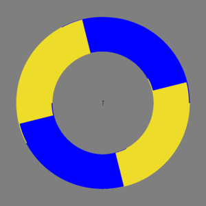

# TikZ TeX TalK

## Cycloid



```latex
% cycloid.tex
\documentclass[tikz]{standalone}
\begin{document}
\def\wheel#1;{
    \begin{scope}#1
        \clip\pgfextra{\pgfseteorule}circle(5)circle(3);
        \fill[yellow!90!black](-9,-9)rectangle(9,9);
        \fill[rotate=\f*14,blue](-9,-9)rectangle(0,0)rectangle(9,9);
    \end{scope}
}
\foreach\f in{1,...,90}{ % frame
    \tikz{
        \fill[gray](-6,-6)rectangle(6,6);
        
        \pgfmathsetmacro\dx{0.05*cos(-\f*4)}
        \pgfmathsetmacro\dy{0.05*sin(-\f*4)}
        \wheel[shift={(\dx,\dy)},rotate=-14]; % help wheel
        \wheel[shift={(-\dx,-\dy)},rotate=14]; % help wheel
        \wheel[]; % main wheel
        
        \draw[->,scale=3](\dy,-\dx)--(-\dy,\dx);
    }
}
\end{document}
```

Convert pdf to gif with terminal command (with ImageMagick installed)

```shell
convert -delay 2 cycloid.pdf cycloid.gif
```

or with this command that does anti-aliasing

```shell
convert -delay 2 -density 300 -resize 300x300 cycloid.pdf cycloid.gif
```

This is inspired by <https://twitter.com/jagarikin/status/1331409504953540613>.

## Diffuse


```latex
% diffuse.tex
\documentclass[tikz]{standalone}
\begin{document}
\def\textdiffuse#1{\relax%
    \def\diffcoeff{50}%
    \pdfliteral{q 1 J 1 j 1 Tr}%
    \foreach\mixture in{5,10,...,45}{\relax%
        \color{darkgray!\mixture!white}%
        \pgfsetlinewidth{(105-2*\mixture)/\diffcoeff}%
        \rlap{#1}%
    }%
    \pdfliteral{q 4 Tr}%
    \color{darkgray}%
    \rlap{#1}%
    \pdfliteral{1 Tr}%
    \foreach\mixture in{95,90,...,55}{\relax%
        \color{darkgray!\mixture!white}%
        \pgfsetlinewidth{(2*\mixture-95)/\diffcoeff}%
        \rlap{#1}%
    }%
    \pdfliteral{Q}%
    \pgfsetlinewidth{5/\diffcoeff}%
    \color{darkgray!50!white}%
    \rlap{#1}%
    \pdfliteral{Q}%
    \phantom{#1}%
}
\Huge\bfseries
\tikz\node[align=center,scale=10,fill=white]{
    Quick \textdiffuse{Blurred Fox}	\\
    Jumps over	\\
    \colorlet{darkgray}{red}
    the \textdiffuse{Laser Dog}
};
\end{document}
```

Convert pdf to jpg (or png in exchange for file size)
with terminal command (with ImageMagick installed)

```shell
convert -density 144 -resize 2000 diffuse.pdf diffuse.jpg
```
