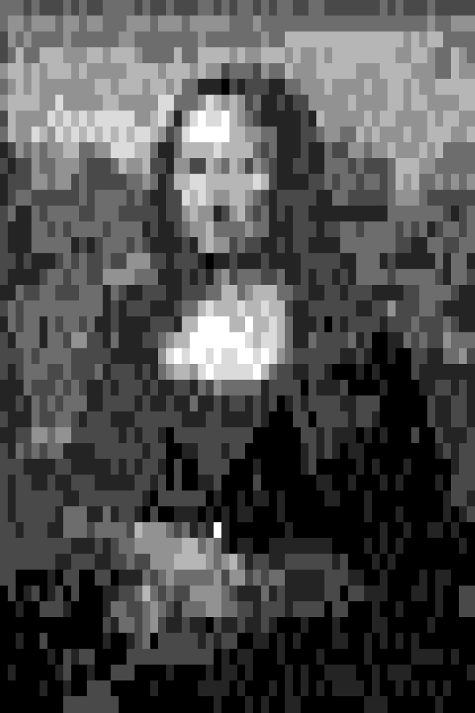

# TikZ TeX TalK

## Cycloid


```latex
% cycloid.tex
\documentclass[tikz]{standalone}
\begin{document}
\def\wheel#1;{
    \begin{scope}#1
        \clip\pgfextra{\pgfseteorule}circle(5)circle(3);
        \fill[yellow!90!black](-9,-9)rectangle(9,9);
        \fill[rotate=\f*14,blue](-9,-9)rectangle(0,0)rectangle(9,9);
    \end{scope}
}
\foreach\f in{1,...,90}{ % frame
    \tikz{
        \fill[gray](-6,-6)rectangle(6,6);
        
        \pgfmathsetmacro\dx{0.05*cos(-\f*4)}
        \pgfmathsetmacro\dy{0.05*sin(-\f*4)}
        \wheel[shift={(\dx,\dy)},rotate=-14]; % help wheel
        \wheel[shift={(-\dx,-\dy)},rotate=14]; % help wheel
        \wheel[]; % main wheel
        
        \draw[->,scale=3](\dy,-\dx)--(-\dy,\dx);
    }
}
\end{document}
```

Convert pdf to gif with terminal command (with ImageMagick installed)

```shell
convert -delay 2 cycloid.pdf cycloid.gif
```

or with this command that does anti-aliasing

```shell
convert -delay 2 -density 300 -resize 300x300 cycloid.pdf cycloid.gif
```

This is inspired by じゃがりきん's
[twitter post](https://twitter.com/jagarikin/status/1331409504953540613).

## Diffuse


```latex
% diffuse.tex
\documentclass[tikz]{standalone}
\begin{document}
\def\textdiffuse#1{\relax%
    \def\diffcoeff{50}%
    \pdfliteral{q 1 J 1 j 1 Tr}%
    \foreach\mixture in{5,10,...,45}{\relax%
        \color{darkgray!\mixture!white}%
        \pgfsetlinewidth{(105-2*\mixture)/\diffcoeff}%
        \rlap{#1}%
    }%
    \pdfliteral{q 4 Tr}%
    \color{darkgray}%
    \rlap{#1}%
    \pdfliteral{1 Tr}%
    \foreach\mixture in{95,90,...,55}{\relax%
        \color{darkgray!\mixture!white}%
        \pgfsetlinewidth{(2*\mixture-95)/\diffcoeff}%
        \rlap{#1}%
    }%
    \pdfliteral{Q}%
    \pgfsetlinewidth{5/\diffcoeff}%
    \color{darkgray!50!white}%
    \rlap{#1}%
    \pdfliteral{Q}%
    \phantom{#1}%
}
\Huge\bfseries
\tikz\node[align=center,scale=10,fill=white]{
    Quick \textdiffuse{Blurred Fox}    \\
    Jumps over    \\
    \colorlet{darkgray}{red}
    the \textdiffuse{Laser Dog}
};
\end{document}
```

Convert pdf to jpg (or png in exchange for file size)
with terminal command (with ImageMagick installed)

```shell
convert -density 144 -resize 2000 diffuse.pdf diffuse.jpg
```

Related to TeX.SX post <https://tex.stackexchange.com/a/545948/51022>
and less related to <https://tex.stackexchange.com/a/544134/51022>.

## Inversion


```latex
% inversion.tex
\documentclass[border=9,tikz]{standalone}
\begin{document}
\def\LennaIpsum{\includegraphics[width=2cm]{lenna.png}\llap\LaTeX}
\def\RememberInversion(#1,#2){
    \expandafter\xdef\csname Inv(\u,\v)x\endcsname{\xx}
    \expandafter\xdef\csname Inv(\u,\v)y\endcsname{\yy}
}
\def\RecallInversion#1(#2,#3){
    \expandafter\xdef\csname#1x\endcsname{\csname Inv(#2,#3)x\endcsname}
    \expandafter\xdef\csname#1y\endcsname{\csname Inv(#2,#3)y\endcsname}
}
\tikz{
    \draw circle(.05)circle(5)(3,0)node{\LennaIpsum}(12.5,0);
    \draw[dotted](4,-5)--(4,5)(3.125,0)circle(3.125);
    \foreach\u in{-10,...,10}{
        \foreach\v in{-10,...,10}{
            % Affine transformation of (u, v), unit mm
            \pgfmathsetmacro\uu{\u+30}
            \pgfmathsetmacro\vv{\v+0}
            \pgfmathsetmacro\rr{\uu*\uu+\vv*\vv}
            % Take inversion, unit mm
            \pgfmathsetmacro\xx{50*\uu/\rr*50}
            \pgfmathsetmacro\yy{50*\vv/\rr*50}
            % Remember the coordinates
            \RememberInversion(\u,\v)
        }
    }
    \foreach\u in{-10,...,9}{
        \foreach\v in{-10,...,9}{
            % For every square, recall the coordinates of the four corners
            \pgfmathtruncatemacro\U{\u+1}
            \pgfmathtruncatemacro\V{\v+1}
            \RecallInversion NW(\u,\V)\RecallInversion NE(\U,\V)
            \RecallInversion SW(\u,\v)\RecallInversion SE(\U,\v)
            % The lower left triangle ◺
            \pgfmathsetmacro\aa{\SEx-\SWx}\pgfmathsetmacro\ab{\SEy-\SWy}
            \pgfmathsetmacro\ba{\NWx-\SWx}\pgfmathsetmacro\bb{\NWy-\SWy}
            \pgflowlevelobj{
                \pgfsettransformentries\aa\ab\ba\bb{\SWx mm}{\SWy mm}
            }{
                \clip(1.02mm,0)-|(0,1.02mm)--cycle;
                \path(-\u mm,-\v mm)node{\LennaIpsum};
            }
            % The upper right triangle ◹
            \pgfmathsetmacro\aa{\NEx-\NWx}\pgfmathsetmacro\ab{\NEy-\NWy}
            \pgfmathsetmacro\ba{\NEx-\SEx}\pgfmathsetmacro\bb{\NEy-\SEy}
            \pgflowlevelobj{
                \pgfsettransformentries\aa\ab\ba\bb{\NEx mm}{\NEy mm}
            }{
                \clip(-1mm,.01mm)-|(.01mm,-1mm)--cycle;
                \path(-\U mm,-\V mm)node{\LennaIpsum};
            }
        }
    }
}
\end{document}
```

`lenna.png` is taken from wikipedia.
Convert pdf to jpg with terminal command (with ImageMagick installed)

```shell
convert -density 300 inversion.pdf inversion.jpg
```

This is the final form of a series of answers on TeX.SX, including
<https://tex.stackexchange.com/a/332173/51022> and
<https://tex.stackexchange.com/a/336821/51022> and
<https://tex.stackexchange.com/a/376128/51022> and
<https://tex.stackexchange.com/a/479188/51022>.

## Galaxy


```latex
% galaxy.tex
\documentclass[tikz]{standalone}
\begin{document}
\foreach~in{0,5,...,179.9}{
    \pgfdeclarefunctionalshading{Stars}
    {\pgfpoint{-25bp}{-25bp}}{\pgfpoint{25bp}{25bp}}{}{
        % X Y
        1 index      % X Y X
        floor .5 add % X Y U:=floor(X)+.5
        1 index      % X Y U Y
        floor .5 add % X Y U V:=floor(Y)+.5
        2 copy       % X Y U V U V
        2 copy       % X Y U V U V U V
        25 div       % X Y U V U V U v:=V/25
        dup mul      % X Y U V U V U v²
        exch         % X Y U V U V v² U
        25 div       % X Y U V U V v² u:=U/25
        dup mul      % X Y U V U V v² u²
        add sqrt     % X Y U V U V r:=√u²+v²
        360 mul      % X Y U V U V R:=360r
        3 1 roll     % X Y U V R U V
        atan         % X Y U V R θ
        ~ add        % add the phase
        add          % X Y U V τ:=R+θ+phase
        sin          % X Y U V sin(τ)
        dup mul      % X Y U V s:=sin(τ)²
        5 1 roll     % s X Y U V
        3 2 roll     % s X U V Y
        sub 2 mul    % s X U y:=2(V-Y)
        dup mul      % s X U y²
        3 1 roll     % s y² X U
        sub 2 mul    % s y² x:=2(X-U)
        dup mul      % s y² x²
        add          % s q:=y²+x²
        le {0 0 0} {1 1 1} ifelse % s ≤ q ? black : white
    }
    \tikz\path[shading=Stars](-10,-10)rectangle(10,10);
}
\end{document}
```

ImageMagick does not convert this pdf properly.
(In general, it has issues with functional shading.)
I ended up using online conversion tools.

This is inspired by <http://www.peda.com/grafeq/gallery.html>.

# Egg


```latex
% egg.tex
\documentclass[tikz]{standalone}
\def\ditherdivide{ %%%  y  x  dither_score  power_of_2
    2 mul 4 2 roll 2 mul dup cvi 1 and 2 mul
    3 2 roll 2 mul dup 4 1 roll cvi 1 and
    3 mul xor 5 4 roll add 4 div 4 3 roll
}
\pgfdeclarefunctionalshading{ordered dithering egg}
    {\pgfpoint{0bp}{0bp}}{\pgfpoint{50bp}{50bp}}{}{
    %%%  X:[0,50]  Y:[0,50]
    50 div exch 50 div 0.5 1
    %%%  y:[0,1]  x:[0,1]  0.5:dither_score  1:power_of_2
    \ditherdivide
    \ditherdivide
    \ditherdivide
    \ditherdivide
    \ditherdivide
    \ditherdivide
    \ditherdivide
    \ditherdivide
    %%%   Y:[0,power2]  X:[0,power2]  score power2
    4 2 roll floor 2 index div  %  score  power2  Y  x
    3 1 roll floor exch div     %  score  x  y
    %%%  score  x:[0:1]  y:[0,1]
    .5 sub 2.2 mul exch .5 sub 2.2 mul  %  recenter and rescale
    1 index 5 div 1.3 add mul   %  score  x  y(1.3+x/5)
    %%%  score  u:=x  v:=y(1.3+x/5)
    dup dup mul                 %  score  u  v  v^2
    2 index dup mul add         %  score  u  v  r=radial
    1 ge {pop pop 0.5} {
    %   https://tex.stackexchange.com/a/75994
        dup dup mul 2 index dup mul add 1 sub   %  -w(u,v)^2
        .3 dup mul .4 dup mul add 1 sub         %  -w(.3,.4)^2
        mul sqrt                %  ww'
        exch .3 mul add         %  += vv'
        exch .4 mul add         %  += uu'
        dup abs add 2 div       %  keep if ≥ 0 otherwise 0
        .1 add                  %  affine transform light
    }ifelse
    %%%  score  light
    le {1} {0} ifelse           %  sum<light
}
\begin{document}
    \tikz\shade[shading=ordered dithering egg]
        (0,0)rectangle(4in,4in);
\end{document}

```

Using macOS Preview.app to convert pdf to png (with resolution 256
pixel/inch).  But if you look closely, the “correct” resolution should
be 128 pixel/inch.  Turns out there are some rounding issues no matter I
use `floor` or `round` in the code.  The issues go away when the
resolution is doubled.

This is a derivation of <https://tex.stackexchange.com/a/267088/51022>,
motivated by Kurzgesagt's video
[The Egg - A Short Story](https://www.youtube.com/watch?v=h6fcK_fRYaI).

# Email

This is not Ti*k*Z.  But this piece of TeX code
generates my old, deprecated email `hpwang2@illinois.edu`.

```latex
\def~#1#2{#1\catcode`#27
~}~^^((((7000077777!!!!.
''''rrrr44440444400)))),
,,,,,)))())./////)))3333
~....%$$$$577757775\endr
```

This piece of TeX code generates my old, deprecated email
`hsw001@ucsd.edu`.

```latex
\def~#1#2{#1\catcode`#27
~}~^^((((733337)))pppppq
qqq444400005####5553$$$$
mmmn\%%%%666647775)\endq
```

Try it on Overleaf!  But either you need to change the compiler to TeX
manually (which is not quite easy), or you can wrap the code above using:

```latex
\documentclass{article}
\let\oldend=\end
\def\end#1~{\let\end\oldend}
\begin{document}
...
\end{document}
```

The trick is that TeX has this neat feature that `^^68` is interpret as
the letter `h` because the ASCII code for the letter `h` is `0x68`.  TeX
also interprets `^^(` as the letter `h` because the ASCII code for the
left parenthesis `(` and the ASCII code for the letter `h` differ by
sixty-four.  With this trick, lowercase letters `abcd...` can be
**expanded** into `^^61^^62^^63^^64...` or, less obviously
`^^!^^"^#^^$...`.

However, it would be less mysterious if one sees two superscript symbols
`^^` everywhere in a code.  So TeX also has this neat feature that it
doesn't have to be two superscript symbols; any repeated symbols whose
category code is seven will work.  For instance, if we change the
category code of the left parenthesis to seven by ```\catcode`(=7```,
then `(((` equals `^^(` equals `h`.  Similarly, if you change the
category code of the number six to seven by ```\catcode`6=7```, then
`6668` equals `^^68` equals `h`.

Now it becomes a matter of looking up every letter in your email address
and choose either `^^68` or `^^(`, whichever maximizes the obscurity.

These pieces of code are motivated by the (unnecessary) need to hide
one's email address from *non-experts*.  This is inspired by the famous
file [`xii.tex`](https://ctan.org/tex-archive/macros/plain/contrib/xii).

## Bonsai


```latex
\documentclass[tikz]{standalone}
\begin{document}
    \usepgfmodule{parser}
    \pgfparserdef{bonsai}{initial}{the character :}{
        % \PackageWarning{bonsai}{execute :}
        \definecolor{root}{Hsb}{40,1,0.3}
        \definecolor{leaf}{Hsb}{80,1,0.6}
        \def\bonsaiwidth{5pt}
        \def\fanout{120}
        \pgfmathsetmacro\angle{\fanout*1.5 + 30}
        \def\factor{100}
    }
    \pgfparserdef{bonsai}{initial}{the character <}{
        % \PackageWarning{bonsai}{execute <}
        \pgfmathsetmacro\angle{\angle - \fanout}
        \path (0, 0) coordinate (stem);
        \bgroup\iffalse\egroup\fi
        \pgfmathsetmacro\angle{\angle * 0.75}
        \pgfmathsetmacro\factor{\factor * (0.8 + abs(\angle/1000))}
        \pgftransformshift{\pgfpointpolarxy{\angle}{\factor/100}}
        \draw [root!\factor!leaf, line width=\factor/100*\bonsaiwidth]
            (stem) to[in=\angle+180+rand*20, out=\angle+rand*20] (0, 0);
        \pgfmathsetmacro\angle{\angle + \fanout*1.5}
    }
    \pgfparserdef{bonsai}{initial}{the character >}{
        % \PackageWarning{bonsai}{execute >}
        \iffalse\bgroup\fi\egroup
    }
    \pgfparserdef{bonsai}{initial}{the character .}{
        % \PackageWarning{bonsai}{execute .}
        \fill [leaf] (0, 0) circle [radius=\factor/500];
    }
    \pgfparserdef{bonsai}{initial}{the character ;}{
        % \PackageWarning{bonsai}{execute ;}
        \pgfparserswitch{final}
    }
    \begin{tikzpicture}
        \tikzset{rotate=90}
        \pgfparserparse{bonsai}:
            <<<.><<.><.>>><<<<.><.>><<<.><.>><<<.><.>><<<<.><.>><<<.><.>
            ><.>>><<<.><.>><.>>>>>><<.><.>>>><<<.><.>><<<<<.><<.><<.><<.
            ><.>>>>><<.><<<><.>><.>>>><<<.><.>><<<<.><.>><.>><.>>>><<<<.
            ><.>><<<.><.>><<.><.>>>><<<.><.>><<<<<.><.>><<<<.><.>><.>><.
            >>><<.><.>>><<<.><.>><.>>>>>>>
        ;
        \tikzset{rotate=-90}
        \filldraw [red!50!black, line width=2pt]
            (-1, 0) -- (1, 0) -- (.7, -.5) -- (-.7, -.5) -- cycle;
    \end{tikzpicture}
\end{document}
```

Convert pdf to png with terminal command (with ImageMagick installed)

```latex
convert -density 600 bonsai.pdf bonsai.png
```

# Pixel art




```latex
% pixel.tex

\documentclass[tikz]{standalone}
	\usepgfmodule{parser}

\begin{document}

\def\pixelartinitial{
    \def\pixelartx{0}
    \def\pixelarty{0}
    \catcode13=12
}
\def\pixelartnextrow{% next row = new line = enter
    \def\pixelartx{0}
    \pgfmathsetmacro\pixelarty{\pixelarty - 1}
}
\def\pixelartput#1{% #1 is a color or tikz options
    \pgfmathsetmacro\pixelartx{\pixelartx + 1}
    \fill [color={#1}] (\pixelartx, \pixelarty) rectangle +(1.05, 1.05);
    % 1.05 is overshoot; necessary to avoid white gaps
}
\def\pixelartfinal{
    \catcode13=5
    \pgfparserswitch{final}
}

\pgfparserdef{pixel art}{initial}{the character <}{\pixelartinitial}
\pgfparserdef{pixel art}{initial}{the character >}{\pixelartfinal}
\catcode13=12\relax%
\pgfparserdef{pixel art}{initial}{the character ^^M}{\pixelartnextrow}%
\catcode13=5\relax
\pgfparserdef{pixel art}{initial}{the character '}{\pixelartput{gray,7:white,0;black,7}}
\pgfparserdef{pixel art}{initial}{the character -}{\pixelartput{gray,7:white,1;black,6}}
\pgfparserdef{pixel art}{initial}{the character ;}{\pixelartput{gray,7:white,2;black,5}}
\pgfparserdef{pixel art}{initial}{the letter l}{\pixelartput{gray,7:white,3;black,4}}
\pgfparserdef{pixel art}{initial}{the letter C}{\pixelartput{gray,7:white,4;black,3}}
\pgfparserdef{pixel art}{initial}{the letter D}{\pixelartput{gray,7:white,5;black,2}}
\pgfparserdef{pixel art}{initial}{the letter H}{\pixelartput{gray,7:white,6;black,1}}
\pgfparserdef{pixel art}{initial}{the letter M}{\pixelartput{gray,7:white,7;black,0}}

\begin{tikzpicture}[x=1mm, y=2mm]
\pgfparserparse{pixel art}<
lll;l;;;l;l;;llll;l;;l;;;ll;l;ll;l;ll;;ll;;;;;;;l;l;;;l;;;;;
lCClCCClCClCClllCCClCCClCCCCClllClllllllllllllllllllllCllCCC
;ClCllllCllllllCCllllllllClllllllCllDDDDDDDDDDDDDDDCDCDDllll
;lDllDDDCCCDDCDDDCllllDllDDDDCDCCDDDCDCCDCDDDDDDDDCCDDCllDCl
CDDCDCDDDCDCCCCCDDDDCDDDCDCC;lll;CllDCCCDDDDDCCCDDDDCCCllDCC
lCDCDCCCCCCCDDCDDDCDDCDll---';-;;;--llCCCDCCCCDCCDDCDCCDDDDD
CDDDDCCHCCCCCDDCCCCCHHlllCHDCDC;l--;-;;CCCCCDCCCCDDCDDCCCCDD
;DCCCCHDHDHDHHHHHCCDHC-CHMHHMDCl;-----;-DCCCCCDCDDCCCCDCDDCC
lDCCHDCHDHDHDHDHDHHDC;lHMMMMMDDCCll---;;lCCllDCDCCCDCCDDDCCD
-;ClClCCDDllCCHHHDDl--lDDDDHDDDDl;l---;--l;;CClCCDCCCDCDllll
;-;;CllCCCl;;;lDCCD;;-CC;;DClDC;Cl;--;;--lll;l;;;lDDDCClllll
-;;;CClCC;l;;;;;llCl-;DDHHDDDDDDHD;----;;l;ll;ll;lDCDllClClC
-;ll;;;;;;l;llll;l;--;;HDHDCCDDCl;-;;;;;--ll;;;;;lCCCl;;;;;;
;l--l;llll;;lll;;;;;-;;CDCC-;CDl;l-;-;;----------lllllll;-;l
;---ll;l;llll;llll-;--;lCCDllllCll---;;;-;;ll;llll;l;l-;ll;l
;---lllll-;-;lll;l;----;-CDCC;l;;--;-;;----lllllll;;--ll;;ll
;;-;---;l;l;;l;;CCC;;-;;;-'--;---;----;;;;;--lll-;-----l-ll-
;----;ll;ll;;CCCClll---;-;-lC;lll;;l--;-;;-;-llll;lllll;-ll;
--l;;ll;;;lll-l;--;;;--;;;llDDlCDDDll;;--;;-;;;----;;llll;--
;l;llllllllll-;-;;;---;llDHDDDHDDHDD;--;;;;;;--;;C;;;ll;----
-l;ll-l;ll;l--;----;;;-DDMMMMDDMDDHDl---;';-;;;;-;;;l;;;l;--
;-lll-ll;CC;;-l---;;lCDDMMMMMMMHDHHDl--l;;;;l-;''--l;l;;Clll
;;;l;llll;;;;;------CHMHMMHMHHMMHMHCl;;;;;;--;-''-'';;--llC;
;-;lll;;l;;;l-;;;-;-lCDDCHMHHHHHMDl;;--;;-'''-'-'''';-------
---l;;;l;l;--;-;;;-;--;;-l;Clllll-;;;;';---;''''-''''--;;-;-
--;-l;l;lll--;;;;-;--;--l--;-;;-;-;'-;-;;;;--;;;'''''';--;;-
;---l;;ll;-;;;---;;;;;;---;;----;-''';;';;;;-;;-'''''';--;;-
--;;CClCC;;;;;;-;-;;-';;;;;;;;;;'''''';;-;---'-'-''';'';---;
;-l;l;ll----;;;;;;-;;''--;;;-;;'''''''-;-;-'--'''''''''-;-;;
;;;----;;-----;-;-;;-';'';;;;'''-'''''-;'''''-'-'''-'''''-;;
;-;;--;--;;;-----;;-;';''--;'''';'''''''--''-'''-'-''''-';;;
;-;;;;;;--;;;;;;;;-';;;;;;'-''-'--'-'''''--'''-'''''''''-;;-
;-;;;;;-lll--l-;;-';''---'-'-'--'''-''''''''''-'''-'''''-'-;
;;-;;;--lll;llll;DCCCl;l-;-M-'''''''-'''''''''''-''-''--'-''
;;;;;;;;;---;-;llCCCCCCDDlCl-'--''--------''''-'-'-'''''''-'
;;;;;;;--;;;--;;l;;CCCDDDDClCDl-;;--;;;;;;-;'''-'-''''''''''
;;''''-';;'';;'---l;lClllllC;CC;l;ll-----;;;--''-''''-'--'''
';'-;'-;';'''--;;lDl;l;;CCCCl;---l-;-----;;';;---'''--'-'';;
''-'';;;-''''-ll;;lCl;-lllCCll;;-;;;-;;;;';;'''-''-''''-'';;
''''''''''''';-ll;lC;--;--';--;--;-'''-'''-''''--'''''-'''''
''-'';'''''''-''-;l';;;;;-;-;;''--'-'-''''--''-'-'-'-'''''''
''''''-';-;;'''';;;;;;;;;;;'-'--'''-''''-'''''-'''''----'-''
'-'''''-;''-'';;;''''-''''-'--'-''''-'-''----''-'---'''''''-
'''''-''-'';;;'''''-'''''----'-'''-'-'-'-'----'-''-'-'-'-'''
'''''''';;;;;;;''''''''''''-'''-'-''--''''''''---''''''-''''
>
\end{tikzpicture}

\end{document}
```

Convert pdf to png with terminal command (with ImageMagick installed)

```latex
convert -density 300 pixel.pdf pixel.png
```
